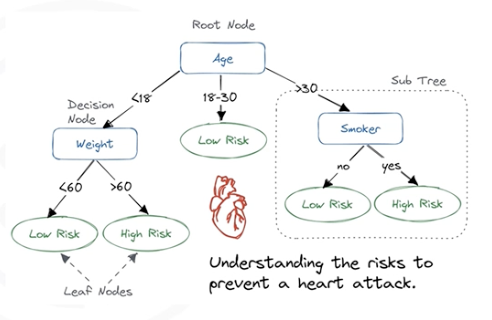

# Decision Trees

## 1. The Intuitive Idea: A Flowchart of Decisions

A **Decision Tree** is a supervised learning algorithm that works like a flowchart. It asks a series of simple questions about the data to arrive at a final classification decision. It's one of the most interpretable machine learning models because you can literally see the decision-making process.

The tree is composed of three main parts:
* **Internal Nodes:** Represent a "test" on a specific feature (e.g., "Is `age` < 30?")
* **Branches:** Represent the outcome of the test (e.g., "Yes" or "No").
* **Leaf Nodes (or Terminal Nodes):** Represent the final class label or decision (e.g., "Prescribe Drug A")

## 2. How a Decision Tree "Learns": Recursive Partitioning

A Decision Tree is built through a process called **recursive partitioning**. The algorithm tries to split the data into smaller and smaller groups that are as "pure" as possible (i.e., contain only a single class).

The process works as follows:
1. **Start at the Root:** Begin with the entire training dataset in a single node (the root).
2. **Find the Best Split:** The algorithm evaluates every feature to find the one that best splits the data into the purest possible child nodes.
3. **Partition the Data:** The data is split into new child nodes based on the outcome of the best split test.
4. **Repeat:** The algorithm repeats this process for each child node. It continues splitting the data recursively until a stopping condition is met.

The key question is: **"How does the algorithm decide what the 'best' split is?"**

## 3. Splitting Criteria: Finding the Best Questions to Ask
To find the best split, the algorithm needs a way to measure the "purity" of a node. The goal is to choose a split that results in the largest increase in purity.

### 3.1. Entropy
**Entropy** is a measure of randomness, impurity, or disorder in a set of data.
* **High Entropy (Max = 1):** The node is very impure. The classes are mixed evenly (e.g., 50% Drug A, 50% Drug B). There is high certainty.
* **Low Entropy (Min = 0):** The node is perfectly pure. All samples in the node belong to a single class (e.g., 100% Drug A). There is no uncertainty.

### 3.2. Information Gain
**Information gain** is the measure of the reduction in entropy achieved by a split. It's calculated as:  

`Information Gain = Entropy(parent) - [Weighted Average] * Entropy(children)`

### 3.3. Gini Impurity
**Gini impurity** is another common metric used to measure the purity of a node. It's slightly faster to compute than entropy. The goal is the same: find the split that results in the largest reduction in Gini Impurity.

## 4. Preventing Overfitting: Pruning the Tree 

If we allow a Decision Tree to grow until every leaf node is perfectly pure, it will learn the training data perfectly. However, this will cause it to **overfit** -it will capture the noise and random fluctuations in the training data and will fail to generalize to new, unseen data.

To prevent this, we use **pruning**, which involves stopping the tree from becoming too complex. There are two main approaches:

1. **Pre-pruning (Early Stopping):** We set rules to stop the tree from growing before it becomes fully grown. Common stopping criteria include:
    * Setting a **maximum tree depth**.
    * Setting a **minimum number of samples** required to split a node.
    * Setting a **minimum number of samples** required in a leaf node.

2. **Post-pruning:** We first grow the full tree and then remove branches that provide little predictive power. This simplifies the model and improves its ability to generalize.

A pruned tree is simpler, easier to understand, and usually has better predictive accuracy on unseen data.

## 5. Advantages of Decision Trees
* **Highly Interpretable:** They are easy to visualize and understand. You can follow the path of decisions from the root to a leaf.
* **Implicit Feature Selection:** The most important features naturally end up at the top of the tree, providing insight into which predictors are most influential.
* **Handles Mixed Data Types:** They can work with both numerical and categorical data without extensive preprocessing.
* **Non-parametric:** They don't make strong assumptions about the underlying distribution of the data.

## 6. Summary

*   A **Decision Tree** is a flowchart-like model used for classification.
*   It is built using **recursive partitioning**, where the data is repeatedly split to create the purest possible nodes.
*   The "best" split is determined by finding the feature that provides the highest **Information Gain** (or the largest reduction in Gini Impurity).
*   **Pruning** is essential to prevent the tree from becoming too complex and **overfitting** the training data.
*   Decision Trees are popular because they are powerful, easy to interpret, and provide insights into feature importance.

---

**Next:** [Lab: Decision Trees](./04_lab--decision_trees.ipynb)
