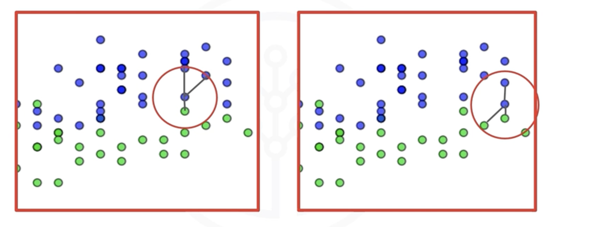
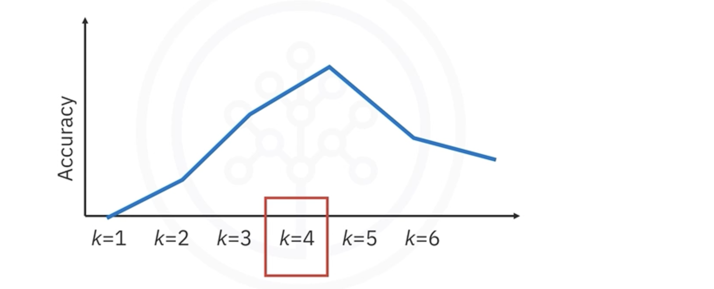

# Supervised Learning with K-Nearest Neighbors (KNN)

## 1. The Core Idea: "Tell Me Who Your Friends Are..."

**K-Nearest Neighbors (KNN)** is a simple, supervised machine learning algorithm used for both classification and regression. Its core principle is intuitive: a data point is likely to be similar to the data points that are closest to it.

The algorithm makes predictions for a new, unlabeled data point by looking at the "K" closest labeled data points in the training set.

## 2. How KNN Works: The Algorithm

KNN is often called a **"lazy learner"** because it doesn't have a distinct training phase where it learns a model. Instead, it memorizes the entire training dataset. The real work happens during prediction time.

Here's the process for a classification task:
1. **Choose a Value for `k`:** This is the number of neighbors to consider.
2. **Calculate Distances:** For a new, unlabeled data point (the query point), calculate its distance to **every single point** in the training dataset. The most common distance metric is **Euclidean distance**.
3. **Find the `k` Nearest Neighbors:** Identify the `k` points from the training set that have the smallest distances to the query point.
4. **Make a Prediction (Majority Vote):** Look at the class labels of these `k` neighbors. The query point is assigned the class that appears most frequently among its neighbors.

* **For Regression:** Instead of a majority vote, the prediction is the **average** or **median** of the target values of the `k` nearest neighbors.

## 3. The Importance of `k`: Finding the Sweet Spot

The choice of `k` is a critical hyperparameter that significantly impacts the model's performance.

* **Small `k` (e.g., `k=1`):** The model is highly sensitive to noise and individual data points. The decision boundary will be very complex and jagged, which can lead to **overfitting**.
* **Large `k` (e.g., `k=30`):** The model considers many neighbors, which smooths out the decision boundary. If `k` is too large, the model might ignore local patterns and become too generalized, leading to **underfitting**.

**How to find the optimal `k`?**  
The standard approach is to test a range of `k` values on a validation set and choose the `k` that yields the highest accuracy or best score.

## 4. Critical Considerations and Best Practices

KNN is simple, but it requires careful data preparation to work well.

### Feature Scaling is Mandatory
Because KNN is based on calculating distances, features with large scales will dominate the distance metric. For example, a feature ranging from 0-1000 will have a much larger effect on the distance than a feature ranging from 0-1.
* **Solution:** You **must** scale your features before applying KNN. `StandardScaler` is a common and effective choice.

### The Curse of Dimensionality
KNN's performance degrades as the number of features increases. In high-dimensional spaces, the concept of "distance" becomes less meaningful, and all points tend to be far apart from each other.
* **Solution:** Use **feature selection** to keep only the most relevant features. This improves accuracy and reduces computational cost.

### Handling Class Imbalance
In its basic form, KNN's majority vote can be biased if the class distribution is skewed. A more frequent class will likely to dominate the predictions simply because it has more data points.
* **Solution:** Use **weighted voting**, where closer neighbors get a larger "vote" than neighbors that are farther away. This can be enabled in scikit-learn's `KNeighborsClassifier` by setting `weights='distance'`.

## 5. Summary
*   KNN is a simple, instance-based algorithm used for classification and regression.
*   It is a "lazy learner" that memorizes the training data and makes predictions based on the `k` closest neighbors.
*   Finding the optimal `k` is a crucial hyperparameter tuning step to balance the bias-variance trade-off.
*   **Feature scaling is absolutely essential** for KNN to perform correctly.
*   The algorithm can be computationally expensive at prediction time, especially with large datasets, because it must calculate distances to all training points.

---

**Next:** [Lab: K-Nearest Neighbors Classifier](./10_lab--k-nearest_neighbors_classifier.ipynb)