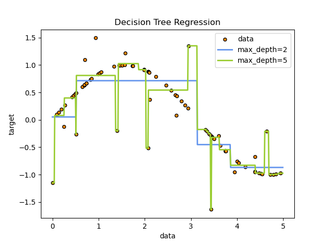

# Regression Trees

## 1. The Intuitive Idea: A Flowchart for Predicting Numbers

A **Regression Tree** is a supervised learning algorithm that predicts a **continuous** target (e.g., price, temperature, revenue) by asking a sequence of simple, human-readable questions about the features. Each internal node poses a decision (e.g., "Is `feature <= threshold`?"), and each leaf node outputs a single numeric prediction. 

Visually and conceptually, a regression tree recursively partitions the feature space into regions where the target values are as similar as possible. This makes regression trees both flexible (non-linear, non-parametric) and highly interpretable (white-box).

## 2. How a Regression Tree Learns: Greedy, Recursive Partitioning

Regression trees are grown top-down using a greedy procedure:

1. Start at the root with the entire training set
2. For every feature and candidate split point, compute an impurity measure (error) in the child nodes. 
3. Select the split that most reduces error.
4. Partition the data into left/right child nodes and repeat the process recursively.
5. Stop when a constraint is met (e.g., minimum samples per leaf, maximum depth) or when no split improves error.
6. Assign predictions to each leaf node as the mean of the target values in that region.

Because the algorithm optimizes splits locally at each node (greedy), it's efficient but not globally optimal. Pruning is used to control complexity and improve generalization.

## 3. Predictions at Nodes and Leaves
At any node, the model's prediction is the **average** of the target values of the samples that fall into that node.

$$
\hat{y}_{\text{node}} = \frac{1}{N_{\text{node}}} \sum_{i \in \text{node}} y^{(i)}
$$

- $\hat{y}_{\text{node}}$: node prediction
- $N_{\text{node}}$: number of samples in the node
- $y^{(i)}$: target value of sample $i$

While the mean is standard (minimizes squared error), the median can be used for robustness to outliers (minimizes absolute deviation), though it's less common in standard implementations.

## 4. Splitting Criterion: Minimizing Mean Squared Error (MSE)
To evaluate a candidate split, regression trees use **Mean Squared Error** (MSE) as the impurity measure. For a node:

$$
\text{MSE}_{\text{node}} = \frac{1}{N_{\text{node}}} \sum_{i \in \text{node}} \left(y^{(i)} - \hat{y}_{\text{node}}\right)^2
$$

This is equivalent to the variance of the target values within the node. For a proposed split into left and right child nodes, we compute the **weighted MSE**:

$$
\text{Weighted MSE} = 
\frac{N_{\text{left}}}{N_{\text{parent}}} \cdot \text{MSE}_{\text{left}}
\;+\;
\frac{N_{\text{right}}}{N_{\text{parent}}} \cdot \text{MSE}_{\text{right}}
$$

The best split minimizes this weighted MSE, producing child nodes with lower variance than the parent.

## 5. Handling Different Feature Types

### 5.1. Continuous Features

To find thresholds for continuous features (e.g., "Is `age <= 35`?"), a common approach is:

1. Sort the unique values of the feature.
2. Define the candidate thresholds at midpoints between consecutive unique values.
3. For each threshold, compute the weighted MSE of the split.
4. Choose the threshold that minimizes weighted MSE.

For very large datasets, implementations may sample candidate thresholds for efficiency.

### 5.2. Categorical Features
- **Binary Categorical Features:** Evaluate the single split (e.g., "Is `sex == male`?") and compute weighted MSE.
- **Multi-class Categorical Features:** Evaluate partitions that group categories into two sets (e.g., {A, C} vs. {B, D}) to find the grouping that minimizes weighted MSE. Practical libraries often apply heuristics to avoid exhaustive search.

## 6. Preventing Overfitting: Controlling Tree Complexity
A fully grown tree can perfectly fit the training data (zero training error) but generalize poorly. Control complexity via:

### 6.1. Pre-Pruning (Early Stopping)
- `max_depth`: Maximum depth of the tree.
- `min_samples_split`: Minimum samples required to attempt a split.
- `min_samples_leaf`: Minimum samples in a leaf node.
- `max_features`: Number of features to consider when looking for the best split.

### 6.2. Post-Pruning (Cost-Complexity Pruning)
Grow the tree and then prune back weak branches using a complexity penalty (as in CART's cost-complexity pruning):

$$
R_\alpha(T) = R(T) + \alpha \cdot |T_{\text{leaves}}|
$$

- $R(T)$: empirical error (e.g., sum of squared errors) of tree $T$
- $\alpha$: complexity parameter controlling the trade-off between fit and simplicity
- $|T_{\text{leaves}}|$: number of leaves

Tune $\alpha$ to select a subtree that reduces overfitting.

## 7. Model-Specific Considerations

### 7.1. Advantages
- **Interpretability:** Simple, rule-based structure; easy to visualize and explain.
- **Minimal Preprocessing:** Invariant to feature scaling; handles mixed types.
- **Non-Parametric & Non-Linear:** Captures complex relationships without linearity assumptions.
- **Implicit Feature Selection:** Most informative features typically appear near the root.

### 7.2. Disadvantages and Pitfalls
- **High Variance:** Trees are unstable; small changes in data can yield different structures.
- **Overfitting:** Without constraints or pruning, trees can memorize noise.
- **Biased Splits:** Features with many potential thresholds/categories may be preferred.
- **Limited Extrapolation:** Predictions are averages from training regions; trees do not extrapolate well outside observed ranges.

Most limitations are mitigated by [ensemble methods](./23_bias_variance_and_ensemble_models_theory.md) (e.g., Random Forests, Gradient Boosting), which average or boost many trees to reduce variance and improve accuracy.

## 8. Summary
- **Regression Trees** predict continuous targets using a hierarchy of if/else splits.
- Splits are chosen to minimize **Weighted MSE**, creating low-variance child-nodes.
- Leaf predictions are the **mean** target value in each final region.
- **Pruning** (depth limits, minimum samples, cost-complexity) is essential to control overfitting.
- Highly **interpretable** but often outperformed by **ensemble** methods for accuracy and robustness.

---

**Next:** [Regression Trees Implementation](./12_regression_trees_implementation.py)