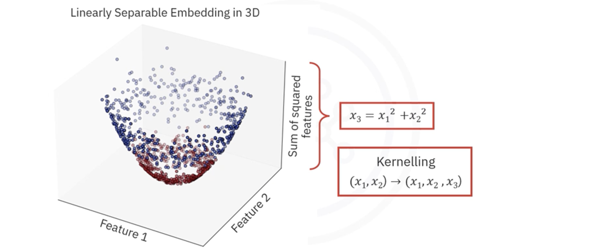

# Support Vector Machines (SVM)

## 1. The Intuitive Idea: The Widest Possible Street

**Support Vector Machines** are a powerful class of supervised learning algorithms used for classification and regression. While simple linear classifiers (like Logistic Regression) find *a* line that separates classes, SVM reaches for the *best* line.

Imagine you are trying to draw a line on a floor to separate red balls from the blue balls. You could draw many lines that work, but the safest line is the one that has the most clearance on both sides.

* **Hyperplane:** The decision boundary (a line in 2D, a plane in 3D, etc.).
* **Margin:** The distance between the hyperplane and the nearest data points from either class. Think of this as the width of the "street" separating the classes.
* **Support Vectors:** The specific data points that define the edge of the street. These are the "hardest" points to classify.

The goal of SVM is **Margin Maximization**: finding the hyperplane that creates the widest possible street. This makes the model more robust and better at generalizing to new data.

## 2. The Mathematics: Defining the Boundary

To implement SVM from scratch, we need to define the hyperplane mathematically.

### 2.1. The Linear Model
Just like Linear Regression, the hyperplane is defined by a weight vector $w$ and a bias $b$. The prediction rule for a data point $x$ is:

$$
f(x) = w \cdot x - b
$$

*   If $w \cdot x - b \geq 0$, we predict **Class +1**.
*   If $w \cdot x - b < 0$, we predict **Class -1**.

> **Note:** Unlike Logistic Regression which uses 0 and 1, SVMs typically use target labels $y \in \{-1, 1\}$.

### 2.2. The Margin Condition
We want our data points not just be on the correct side of the hyperplane, but to be *outside the street*. Mathematically, for a sample $i$ to be correctly classified and outside the margin, we enforce:

$$
y_i (w \cdot x_i - b) \geq 1
$$

* $w \cdot x_i - b$: This is the "score" or distance from the hyperplane.
* $y_i$: This is the true label (-1 or 1).
* If the multiplication is $\geq 1$, it means the point is correctly classified and safely outside the margin.

## 3. Key Assumptions

1. **Linear Separability (initially):** The standard SVM assumes the data can be separated by a linear boundary (though we can fix this with kernels later).
2. **Feature Scaling is Critical:** Because SVM tries to maximize physical distance (Euclidean distance), features with large scales will dominate the margin.
**You must normalize/standardize data** (e.g., `StandardScaler`) before training an SVM.
3. **ID:** Independent and Identically Distributed data.

## 4. How the Model is Trained (Primal Form)

To train the model, we need to find the optimal $w$ and $b$. This involves two competing goals:

1. **Maximize the Margin:** In math terms, this is equivalent to minimizing the magnitude of the weights, $||w||^2$.
2. **Minimize Errors:** Ensure points are on the correct side of the margin.

### 4.1. The Cost Function: Hinge Loss

We combine these goals into a single cost function using **Hinge Loss**.

$$
J(w, b) = \lambda ||w||^2 + \frac{1}{n} \sum_{i=1}^{n} \max(0, 1 - y_i(w \cdot x_i - b))
$$

**$\lambda ||w||^2$** is the regularization term. Minimizing $w$ maximizes the margin. $\lambda$ is a hyperparameter that controls how much we care about having a wide margin versus classifying points correctly. 

**$\max(0, 1 - y_i(w \cdot x_i - b))$** is the Hinge Loss. 
* If a point is correctly classified and outside the margin (score > 1), the value is negative, so the `max` takes **0**. There is no penalty.
* If a point is inside the margin or misclassified (score < 1), the term is positive. The cost increases linearly the further "wrong" the point is.

### 4.2. Optimization: Gradient Descent

To minimize this cost, we use Gradient Descent. We need the derivatives (gradients) with respect to $w$ and $b$.

For each data point $x_i$, we check if the margin condition is met: 

**Is $y_i(w \cdot x_i - b) \geq 1$?**  

1. If the point is correctly classified and outside the margin (Cost is 0), the gradient comes only from the regularization term.

$$ \frac{\partial J}{\partial w} = 2\lambda w $$
$$ \frac{\partial J}{\partial b} = 0 $$

2. If the point is misclassified or inside the margin (Cost > 0), the gradient includes both the regularization term and the data point term.

$$ \frac{\partial J}{\partial w} = 2\lambda w - y_i x_i $$
$$ \frac{\partial J}{\partial b} = y_i $$

> **Python Logic:** When iterating through your data, if the condition is met (Case 1), you update weights slightly towards zero (regularization). If the condition is NOT met (Case 2), you update weights to correct the error.

## 5. Model-Specific Considerations

### 5.1. The Hyperparameter C
In Scikit-Learn, you will see a parameter `C`. This is inversely related to our $\lambda$.
- **Large C (Small $\lambda$):** Strict. We punish errors heavily. Result: Narrow margin, fits training data perfectly, risk of overfitting. ("Hard Margin")
- **Small C (Large $\lambda$):** Loose. We allow some errors to get a wider margin. Result: Simpler model, better generalization. ("Soft Margin")

### 5.2. Non-Linearity: The Kernel Trick
If data is not linearly separable (e.g., concentric circles), we use the **Kernel Trick**.

Instead of transforming data into high dimensions manually (computationally expensive), we use a mathematical shortcut (kernel function) to calculate dot products as if the data were in higher dimensions.

#### Common Kernels:
- **Linear:** Standard dot product.
- **RBF (Radial Basis Function):** Creates circular/complex boundaries.
- **Polynomial:** Creates curved lines.

## 6. Common Pitfalls

- **Forgetting to Scale:** This is the #1 mistake with SVMs. If one feature ranges from 0-1 and another from 0-1000, the margin will be completely distorted.
- **Noise Sensitivity:** SVMs (especially with large C) try hard to classify outliers correctly, which can ruin the boundary for the rest of the data.
- **Large Datasets:** Standard SVM implementations (like `SVC` in sklearn) solve a complex quadratic equation. They can be very slow if you have >100,000 samples. (For large datasets, `LinearSVC` or SGD is better).

## 7. Summary
* **SVM** searches for a hyperplane that maximizes the **margin** between classes.
* It solves an optimization problem balancing **width of the street** ($ ||w||^2 $) and **classification errors** (Hinge Loss).
* **Support Vectors** are the only data points that matter; they "support" the boundary.
* **Feature Scaling** is mandatory.
* The **Kernel Trick** allows SVMs to solve non-linear problems efficiently.

---

**Next:** [Support Vector Machines Implementation](./15_support_vector_machines_implementation.py)