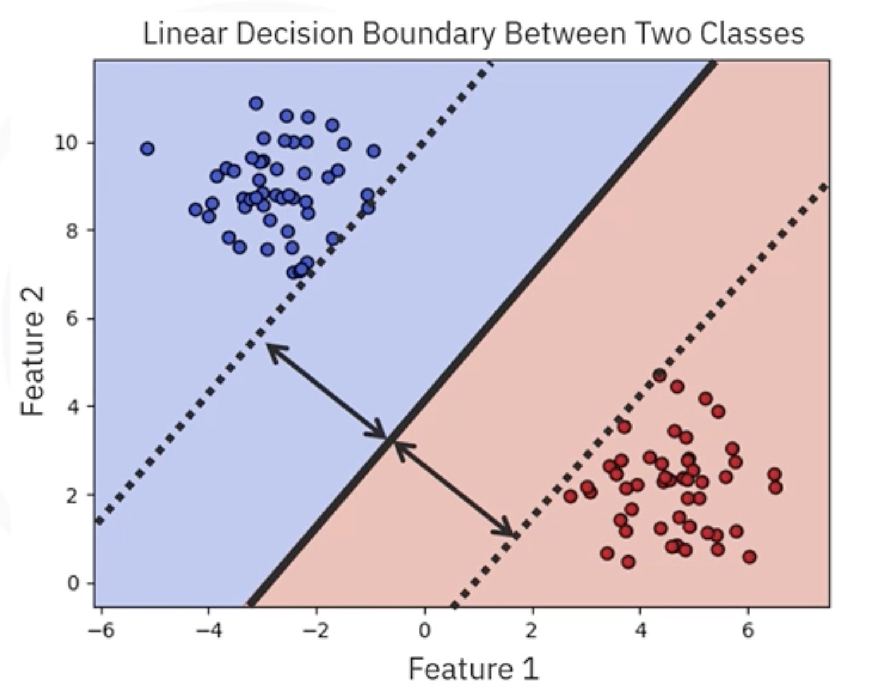

# Support Vector Machines

## 1. The Core Idea: A Maximum-Margin Separator

**Support Vector Machines (SVM)** are supervised learning algorithms for classification and regression. Their goal is to find a decision boundary (a hyperplane) that separates classes with the **largest possible margin** - the distance to the closest points from each class.

- In 2D, the decision boundary is a line; in 3D, a plane; in higher dimensions, a hyperplane.
- The closest points that "pin" the boundary are called **support vectors**. Moving a support vector changes the boundary; most other points are irrelevant for the final decision function.

Maximizing margin typically improves generalization: a wider margin tends to yield a boundary that performs better on unseen data.

## 2. The Mathematics: Hard vs. Soft Margin

### 2.1. Hard-Margin SVM (Perfectly Separable Data)
If data is linearly separable, SVM finds the separating hyperplane with the largest margin:
- Decision function: $f(x) = w^\top x + b$
- Optimization:

$$
\min_{w,b} \ \frac{1}{2}\lVert w \rVert^2 \quad \text{s.t.} \quad y_i\,(w^\top x_i + b) \ge 1 \ \ \forall i
$$

This enforces that all points are correctly classified and lie outside the margin. The geometric margin is $2 / \lVert w \rVert$.