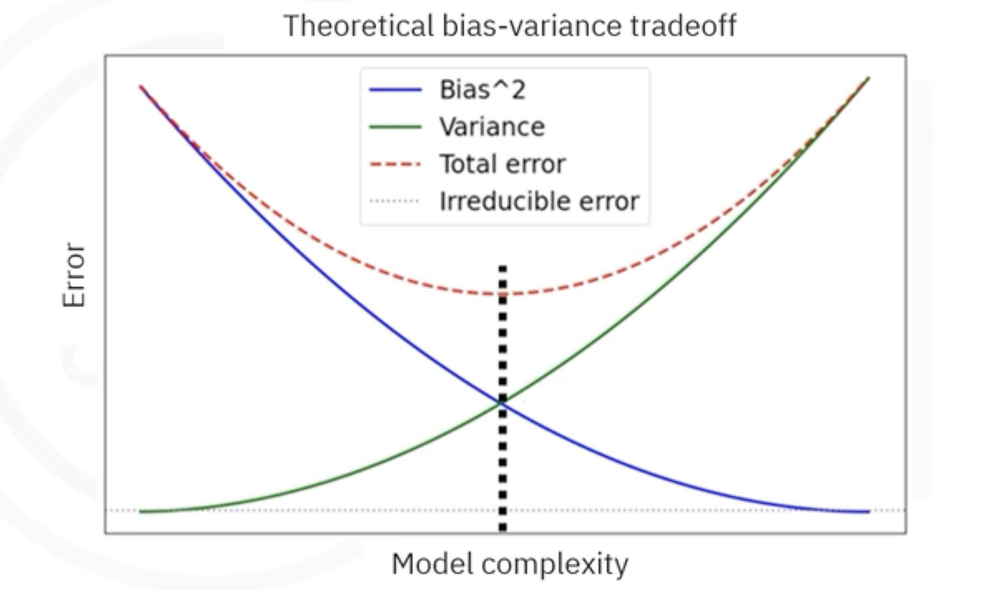

# Bias, Variance, and Ensemble Models

## 1. The Core Concepts: Why Models Fail

To understand how to build better models, we first need to understand the two main ways a model can fail. We can decompose the error of any model into three parts: **Bias**, **Variance**, and **Irreducible Error**.

The dartboard analogy is the standard way to visualize this:

### 1.1. Bias (The Accuracy Error)
**Bias** measures how far off the model's predictions are from the correct value on average. 
- **High Bias:** The model makes strong, simplistic assumptions about the data (e.g., assuming a curved dataset is a straight line).
- **Result:** Underfitting. The model missed the relevant relations between features and target outputs.

### 1.2. Variance (The Consistency Error)
**Variance** measures how much the model's prediction changes if it is trained on a different portion of the data.
* **High Variance:** The model pays too much attention to the specific training data, including the random noise.
* **Result:** Overfitting. The model models the training data too well but fails to generalize to new data.

### 1.3. Irreducible Error
This is the noise intrinsic to the data itself. No matter how good the model is, we cannot reduce this error.

$$
\text{Total Error} = \text{Bias}^2 + \text{Variance} + \text{Irreducible Error}
$$

## 2. The Bias-Variance Tradeoff
There is a fundamental tension in machine learning:
- **Simple models** (e.g., Linear Regression, Shallow Trees) have **high bias** but **low variance**.
- **Complex models** (e.g., Deep Neural Networks, Deep Trees) have **low bias** but **high variance**.

The goal is to find the "sweet spot" (Total Error minimum) where we balance complexity to minimize the sum of bias and variance.

## 3. The Solution: Ensemble Learning
Instead of trying to tune a single model perfectly, **Ensemble Methods** combine multiple models (often called "weak learners") to create a single "strong learner".

The mathematics of probability works in our favor here: If you have many models that are slightly better than random guessing, and their errors are uncorrelated, averaging them produces a result that is much more accurate than any individual model.

## 4. Bagging: Reducing Variance

**Bagging** (Bootstrap Aggregating) is a technique designed to reduce variance. It is typically used with high-variance models (like deep Decision Trees).

### 4.1. The Algorithm
1. **Bootstrap Sampling:** Create $B$ different subsets of the training data. This is done by sampling **with replacement**. (Some data points appear multiple times in a subset, others not at all).
2. **Parallel Training:** Train a separate model $f_b(x)$ on each subset independently.
3. **Aggregation:** Combine the predictions.
    - **Regression:** Average the outputs: $\hat{y} = \frac{1}{B} \sum_{b=1}^{B} f_b(x)$
    * **Classification:** Majority voting.

### 4.2. Key Example: Random Forest
A **Random Forest** is a specific type of Bagging applied to Decision Trees, with one extra trick to further reduce correlation between trees:
- At each split in the tree, the algorithm is only allowed to search through a **random subset of features**, not all features.
- This ensures the trees are diverse (different from each other), which maximizes the benefit of averaging.

## 5. Boosting: Reducing Bias

**Boosting** is a technique designed to reduce bias. It is typically used with high-bias, weak models (like shallow "stump" trees).

### 5.1. The Algorithm (Sequential Learning)
Unlike Bagging (parallel), Boosting trains models **sequentially**.

1. **Train Weak Learner 1:** Train a simple model on the data.
2. **Calculate Errors:** Identify which data points are misclassified or had high errors.
3. **Reweight Data:** Increase the importance (weight) of the difficult/misclassified points.
4. **Train Weak Learner 2:** Train a new model on this reweighted data. This model is forced to focus on the mistakes of the first model.
5. **Repeat:** Continue for $N$ rounds.
6. **Weighted Combination:** The final prediction is a weighted sum of all models, where accurate models get more say.

$$
F(x) = \sum_{t=1}^{T} \alpha_t h_t(x)
$$

- $h_t(x)$: The weak learner at step $t$.
- $\alpha_t$: The weight (trust) assigned to that learner based on its accuracy.

### 5.2. Key Examples
* **AdaBoost:** The original boosting algorithm using weight updates.
* **Gradient Boosting (GBM):** Instead of reweighting data points, each new model tries to predict the **residuals** (errors) of the previous model.
* **XGBoost:** An optimized, highly efficient implementation of Gradient Boosting.

## 6. Summary: Bagging vs. Boosting

| Feature | Bagging (e.g., Random Forest) | Boosting (e.g., XGBoost) |
| :--- | :--- | :--- |
| **Goal** | Reduce Variance (Overfitting) | Reduce Bias (Underfitting) |
| **Base Models** | Complex, Independent (Deep Trees) | Simple, Dependent (Shallow Trees) |
| **Training** | Parallel (Simultaneous) | Sequential (Iterative) |
| **Logic** | "Wisdom of the Crowd" (Averaging) | "Improve on Mistakes" (Error Correction) |

---