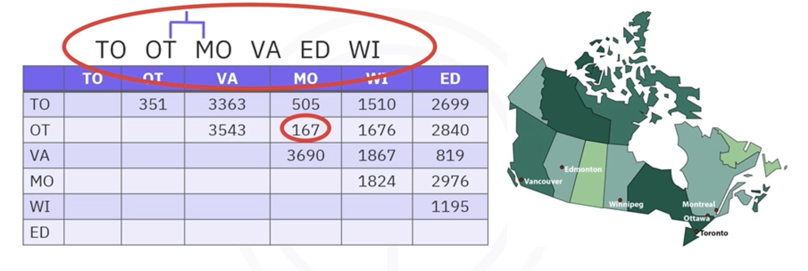
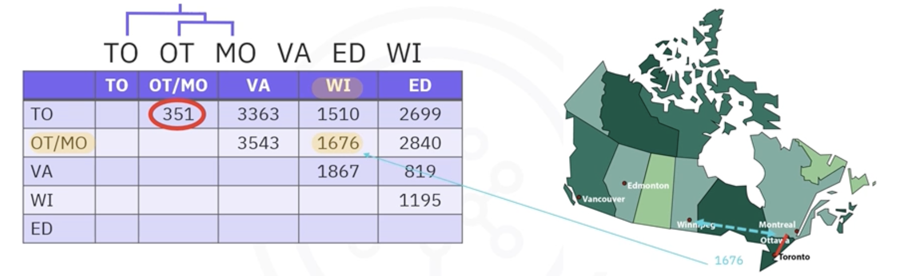
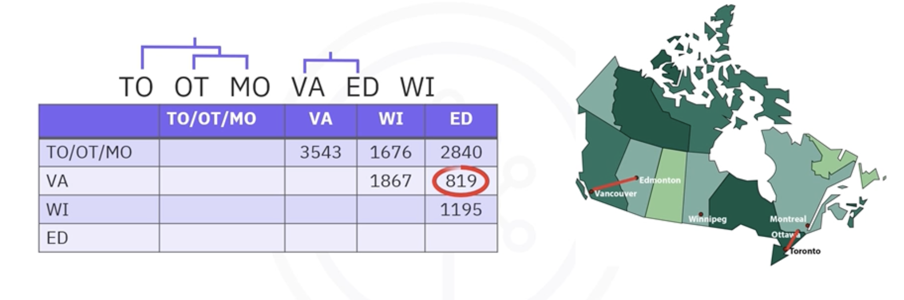
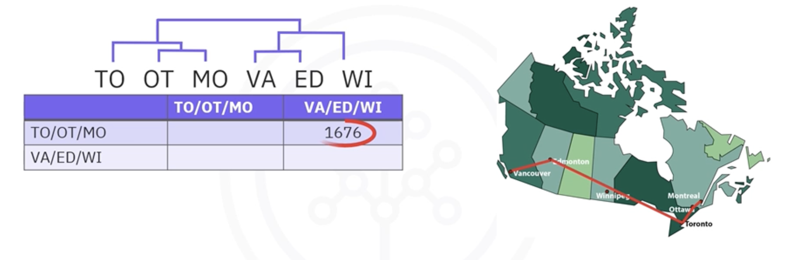

# Clustering Strategies and Real-World Applications

## 1. What is Clustering?

**Clustering** is an unsupervised machine learning technique used to automatically group similar data points together into "clusters." The core idea is that data points within the same cluster should be very similar to each other, while data points in different clusters should be dissimilar.

### Clustering vs. Classification

It's crucial to understand the difference between clustering and classification:

| Feature | Classification | Clustering |
| :--- | :--- | :--- |
| **Learning Type** | Supervised | Unsupervised |
| **Input Data** | Requires *labeled* data (features and known categories) | Works with *unlabeled* data |
| **Goal** | To predict the category for a new data point | To discover natural groupings in the data|

## 2. Real-World Applications of Clustering

Clustering is a versatile technique used across many domains:

* **Customer Segmentation:** Grouping customers based on purchasing behavior, demographics, or web activity to enable targeted marketing.
* **Pattern Recognition:** Used in image segmentation to group pixels of similar color, which can help identify objects or medical abnormalities.
* **Anomaly Detection:** Identifying outliers that do not belong to any cluster, which is useful for fraud detection or detecting equipment malfunctions.
* **Feature Engineering:** Creating new categorical features based on cluster membership to improve the performance of other models.
* **Data Summarization & Compression:** Reducing the size of a large dataset by replacing data points with their cluster centroids (e.g., for image compression).

## 3. The Three Main Types of Clustering Methods
There are many clustering algorithms, but they generally fall into three main categories.

### 3.1. Partition-based Clustering (e.g., K-Means)
This is the most common type of clustering. It divides the data into a pre-defined number (`k`) of non-overlapping groups. The algorithm aims to create clusters where the variance within each cluster is minimized.

* **Strengths:** Very efficient and scales well to large datasets.
* **Weakness:** Assumes clusters are spherical and can struggle with irregularly shaped data.
* **Example:** Works well for identifying distinct, blob-like customer segments.

### 3.2. Density-based Clustering (e.g., DBSCAN)
This method groups together data points that are closely packed together, marking points that lie alone in low-density regions as outliers.

* **Strengths:** Can find arbitrarily shaped clusters and is robust to noise.
* **Weakness:** Can be less efficient on very large datasets compared to K-Means.
* **Example:** Identifying geological formations or separating interlocking shapes.

In the image above, density-based clustering (right) correctly separates the two half-moon shapes, whereas partition-based clustering (left) fails.

### 3.3. Hierarchical Clustering 
This method creates a tree-like hierarchy of nested clusters. The results are visualized using a **dendrogram**, which shows how clusters are merged or split at different levels of similarity.

* **Strengths:** Very intuitive and provides a rich visualization of the data's structure. Doesn't require you to pre-specify the number of clusters.
* **Weakness:** Can be computationally expensive for large datasets.

A dendrogram showing the genetic relationship between dog breeds:

## 4. Hierarchical Clustering Strategies

There are two main approaches to building a hierarchical clustering tree:

### 4.1. Agglomerative Clustering (Bottom-Up)
This is the most common approach.
1. **Initialize:** Start with each data point as its own individual cluster.
2. **Iterate:** In each step, find the two closest clusters and **merge** them into a single new cluster.
3. **Terminate:** Repeat until all data points have been merged into a single, large cluster.

The Canadian cities example shows how Montreal and Ottawa are merged first, then that cluster is merged with Toronto, and so on:

### 4.2. Divisive Clustering (Top-Down)
This approach is less common.
1. **Initialize:** Start with all data points in one single cluster.
2. **Iterate:** In each step, find a cluster and **split** it into two smaller, more distinct clusters.
3. **Terminate:** Repeat until each data point is in its own cluster or another stopping criterion is met.

---

**Next:** [K-Means]()