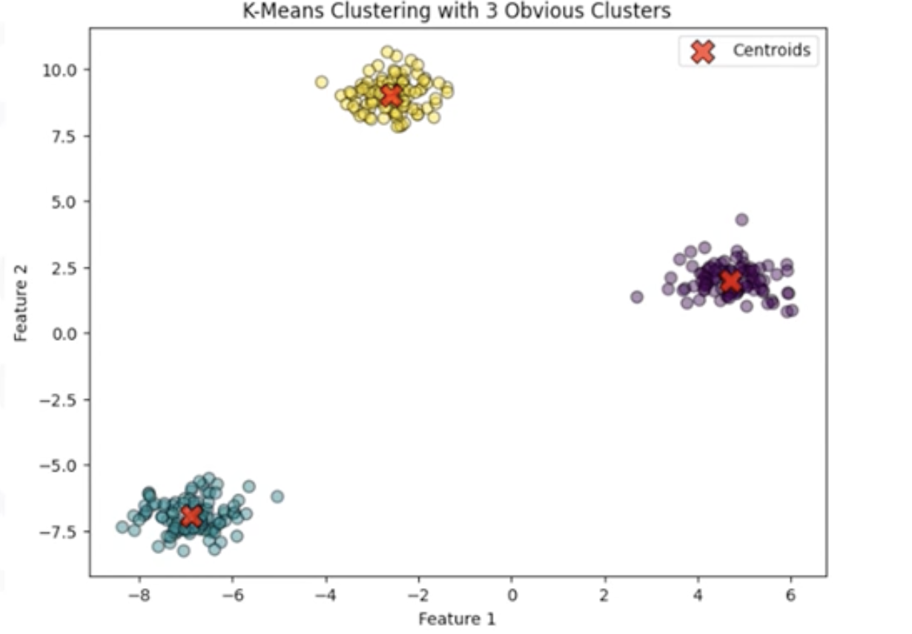
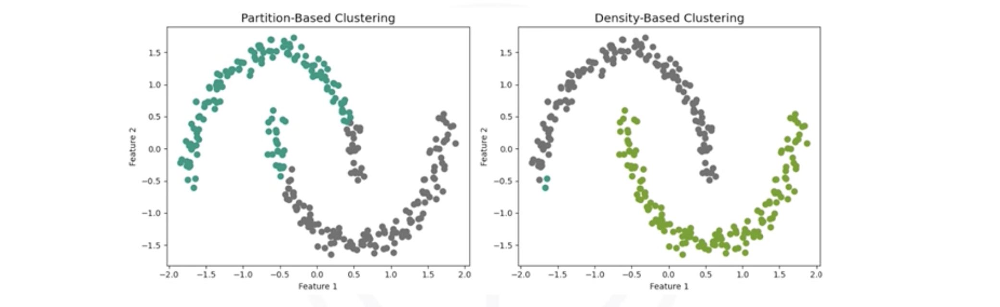
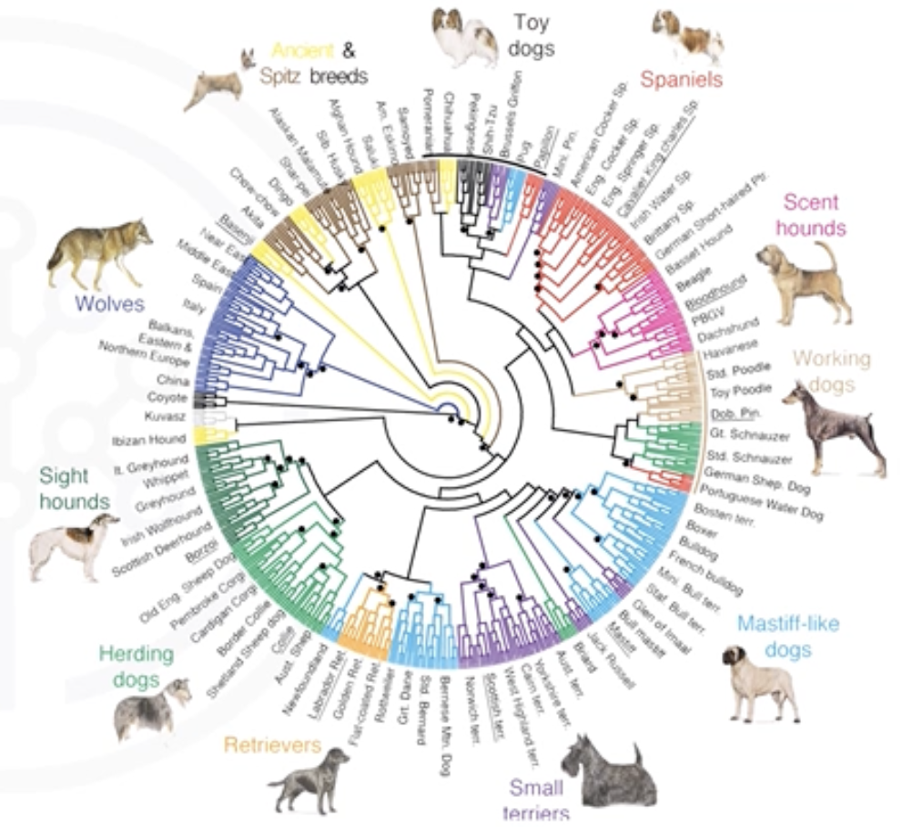

# Clustering Strategies and Real-World Applications

## 1. The Core Idea: What is Clustering?

**Clustering** is the most common technique in **Unsupervised Machine Learning**. Unlike supervised learning, where we have a "teacher" (labels) telling the model what's right and wrong, clustering algorithms work on their own to find structure in unlabeled data.

The goal is simple but powerful: **Group data points so that points in the same group (cluster) are more similar to each other than to points in other groups.**

### Clustering vs. Classification
It is crucial to distinguish between these two:

| Feature | Classification (Supervised) | Clustering (Unsupervised) | 
| :--- | :--- | :--- |
| **Input Data** | Labeled (Features $X$ + Targets $y$). | Unlabeled (Features $X$ only). |
| **Process** | Learns a boundary to separate *known* classes. | Discovers *unknown* groups naturally. |
| **Goal** | Predict the label for new data. | Explore and understand data structure. |

## 2. Real-World Applications

Clustering is often used as a first step in data analysis (EDA) or feature engineering.

* **Customer Segmentation:** Grouping customers by purchasing history (e.g., "High Spenders", "Bargain Hunters") for targeted marketing campaigns.
* **Anomaly Detection:** Data points that do not fit well into *any* cluster are often anomalies (fraud, defects, outliers).
* **Image Segmentation:** Grouping pixels with similar colors or brightness to identify objects in an image.
* **Dimensionality Reduction:** Replacing a group of similar features or data points with a single representative cluster center to compress data.

## 3. The Three Main Families of Algorithms
While there are dozens of clustering algorithms, most fall into three primary categories based on how they define a "cluster".

### 3.1. Partition-based Clustering (e.g., K-Means)
**The Intuition:** These algorithms break the dataset into a pre-defined number ($k$) of non-overlapping distinct groups. They typically work by defining a "center" (centroid) for each cluster and assigning every data point to the closest center.

#### Strengths:
* Simple and easy to implement.
* Computationally efficient; scales well to large datasets.

#### Weaknesses:
* You must specify the number of clusters ($k$) in advance. 
* Assumes clusters are spherical (blob-like). It fails with complex geometric shapes.

 

### 3.2. Density-based Clustering (e.g., DBSCAN)
**The Intutition:** Clusters are defined as dense regions of data points separated by regions of low density. It's like finding islands of data in an empty ocean.

#### Strengths:
* Can discover clusters of **arbitrary shapes** (cruscents, rings, etc.).
* Automatically handles **outliers** (noise points are left unassigned).
* No need to specify the number of clusters beforehand.

#### Weaknesses:
* Struggles if the density of clusters varies significantly across the dataset.
* Can be slower than K-Means on very large datasets.

*In the image above, Density-based clustering (right) correctly identifies the two interlocking half-moons, while Partition-based clustering (left) splits them incorrectly.*

### 3.3. Hierarchical Clustering
**The Intuition:** Instead of a single partitioning, these algorithms build a hierarchy of clusters. This is often visualized as a tree diagram called **Dendgrogram**.

#### Strengths:
* Provides a rich visualization of data relationships (the dendrogram).
* No need to pre-specify the number of clusters; you can "cut" the tree at any level to get the desired number of groups.

#### Weaknesses:
* It is computationally expensive. $O(n^2)$ or $O(n^3)$, making it unsuitable for large datasets.

