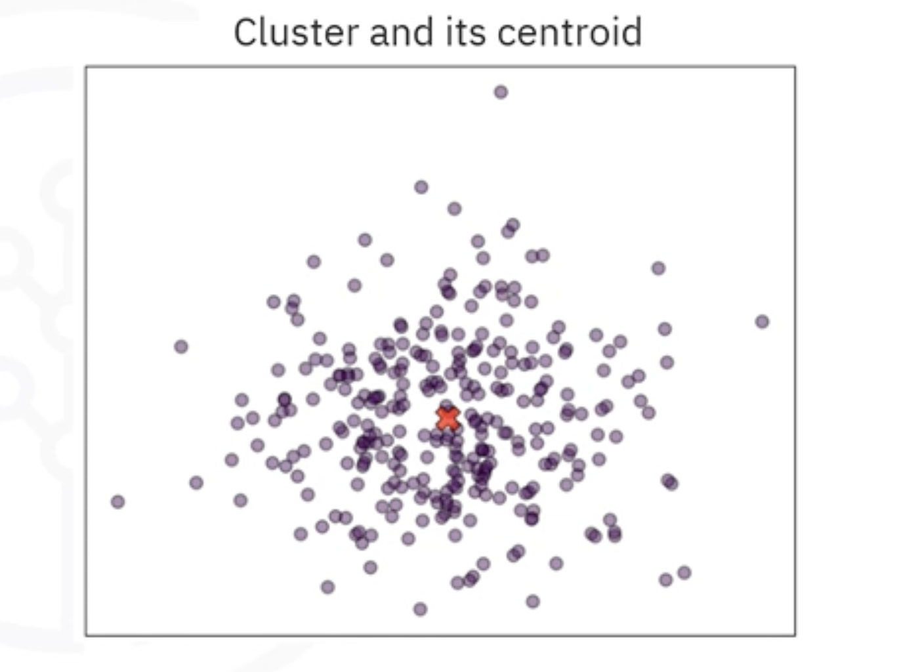
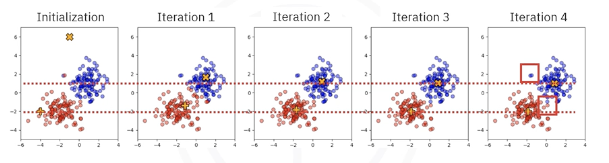

# K-Means Clustering 

## 1. The Intuitive Idea: Partitioning Around Centroids

**K-Means** is a popular, iterative, centroid-based clustering algorithm. It partitions a dataset into $k$ non-overlapping sub-groups (clusters) where each data point belongs to the cluster with the nearest mean (centroid).

The core goal of the algorithm is to create clusters that have:
* **Minimal Variance:** Points within a cluster should be as close to each other (and the center) as possible.
* **Maximum Dissimilarity:** Different clusters should be as distinct from each other as possible.

* The **centroid** is the "center" of the cluster, marked by an X in visualizations. It represents the **average position** of all data points assigned to that cluster.
* The parameter **$k$** is the number of clusters you want to find. A higher $k$ creates smaller, more detailed clusters; a lower $k$ creates larger, broader groups.

## 2. How the Algorithm Works
K-Means is an iterative process that keeps moving the centroids until they find the optimal position.

1. **Initialize:** Choose the number of clusters $k$. Randomly select $k$ starting points as the initial centroids (these can be random data points or random locations in the feature space).
2. **Assign:** For every data point in the dataset, calculate the distance to each of the `k` centroids. Assign the data point to the cluster of the **nearest** centroid.
3. **Update:** Recalculate the position of the centroids. The new centroid becomes the **mean** (average) of all the data points currently assigned to that cluster.
4. **Repeat:** Repeat steps 2 and 3 until the centroids stop moving (convergence) or a maximum number of iterations is reached.

## 3. The Mathematics: Minimizing Variance

The algorithm tries to minimize the **Within-Cluster Sum of Squares (WCSS)**, also known as **Inertia**. Mathematically, this is a double sum over each cluster $i$ and each point $x$ within that cluster:

$$
J = \sum_{i=1}^{k} \sum_{x \in C_i} ||x - \mu_i||^2
$$

* $k$: The number of clusters.
* $C_i$: The set of points belonging to cluster $i$.
* $\mu_i$: The centroid (mean) of cluster $i$.
* $||x - \mu_i||^2$: The squared distance (usually Euclidean) between a point $x$ and its centroid.

By minimizing this objective function, K-Means tightens the clusters, ensuring points are as close to their assigned centroid as possible.

## 4. Key Assumptions and Limitations

While K-Means is efficient and scales well to big data, it relies on specific assumptions about the data geometry.

1. **Convex Clusters:** K-Means assumes clusters are spherical or convex (blob-like). It fails to identify complex shapes like rings, moons, or interlocking spirals because it relies strictly on distance from a center point.
2. **Balanced Cluster Sizes:** The algorithm works best when clusters contain roughly the same number of points. In imbalanced datasets (e.g., one cluster has 200 points, another has 10), the centroid of the smaller cluster may drift or be consumed by the larger cluster.
3. **Sensitivity to Noise:** Since the centroid is a mean, it is highly sensitive to outliers. A few extreme values can pull the centroid away from the true center of the cluster.

## 5. Choosing the Right $k$

One of the biggest challenges is that $k$ is a hyperparameter you must choose *before* running the algorithm. If $k$ is wrong, the results will be meaningless. So, how do we find the optimal $k$?

- **Visual Inspection:** For low-dimensional data, scatter plots can hint at natural groupings.
- **The Elbow Method:** Plot the Inertia (WCSS) against different values of $k$. Look for the "elbow" point where the reduction in variance slows down significantly. 
- **Silhouette Analysis:** Measures how similar a point is to its own cluster (cohesion) compared to other clusters (separation).
- **Davies-Bouldin Index:** Measures the average similarity ratio of each cluster with its most similar cluster. Lower scores are better.

## 6. Summary

- **K-Means** is an iterative algorithm that partitions data into $k$ clusters based on centroid distance.
- It consists of two main steps: **Assigning** points to the nearest centroid, and **Updating** centroids to the mean of the assigned points.
- The goal is to **minimize within-cluster variance**.
- It assumes clusters are **convex** and roughly **balanced**. It struggles with complex shapes and outliers.
- Finding the right $k$ often requires heuristic methods like the **Elbow Method** or **Silhouette Analysis**.

---

**Next:** [K-Means Clustering Implementation](./03_k-means_clustering_implementation.py)