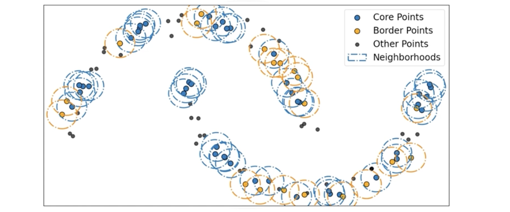
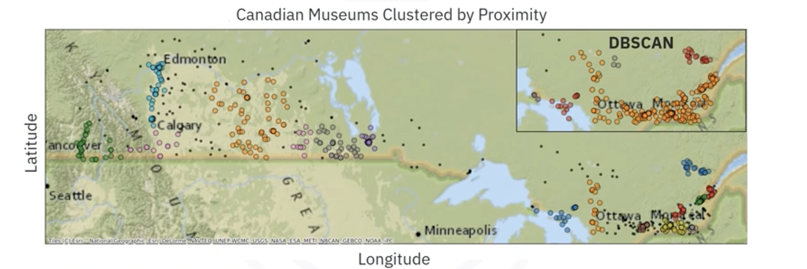

# DBSCAN and HDBSCAN Clustering

## 1. The Intuitive Idea: Density-Based Clustering

Standard clustering algorithms like K-Means are "centroid-based." They assume clusters are spherical blobs and try to assign every point to a group, often forcing outliers into clusters where they don't belong.

**DBSCAN** (Density-Based Spatial Clustering of Applications with Noise) takes a different approach. It defines clusters based on **density**, regions where data points are packed closely together. 

* **Arbitrary Shapes:** It can find clusters of any shape (crescents, spirals, irregular blobs), not just spheres.
* **Noise Handling:** It explicitly identifies and excludes "noise" points (outliers) that do not belong to any dense cluster.
* **Unknown Number of Clusters:** Unlike K-Means, you do *not* need to tell it how many clusters ($k$) to find. It discovers the number of clusters automatically based on the data's density.

## 2. DBSCAN: How It Works

DBSCAN relies on two main parameters to define "density":
1. **`epsilon` ($\epsilon$):** The radius of the neighborhood around a data point.
2. **`min_samples` ($n$):** The minimum number of points required within that radius to form a dense region.

### 2.1. Point Classifications
The algorithm classifies every data point into one of three categories:

1. **Core Point:** A point that has at least `min_samples` points (including itself) within its `epsilon` radius. These are the "anchors" of a cluster.
2. **Border Point:** A point that is within the `epsilon` radius of a Core Point but does not have enough neighbors itself to be a Core Point. It is part of the cluster but sits on the edge.
3. **Noise Point:** A point that is neither a Core Point nor a Border Point. It is isolated in a low-density region and is treated as an outlier.

### 2.2. The Clustering Process 
DBSCAN is **not iterative** like K-Means. It grows clusters in a single pass:

1. Pick an unvisited point.
2. If it's a **Core Point**, a new cluster is started. The algorithm then recursively adds all directly reachable neighbors (density-connected points) to this cluster.
3. If it's a **Border Point**, it is assigned to the cluster of the Core Point that reached it.
4. If it's a **Noise Point**, it is left unassigned (for now, though it might be visited later and found to be a border point of a different cluster).
5. Repeat until all points have been visited.

## 3. HDBSCAN: Hierarchical DBSCAN

While DBSCAN is powerful, it has a limitation: it assumes all clusters have the **same density** If your dataset has one very dense cluster and one sparse cluster, it's hard to find a single `epsilon` that works for both.

**HDBSCAN** (Hierarchical DBSCAN) extends DBSCAN to fix this. It is a combination of **agglomerative** (hierarchical) clustering and **density-based** clusteirng.

### 3.1. How It Improves on DBSCAN
* **Parameter-Free (Mostly):** It essentially eliminates the need to choose `epsilon`. It adapts the density threshold automatically. 
* **Varying Densities:** It can find clusters of varying densities simultaneously.
* **Cluster Stability:** Instead of a fixed radius, it looks for "stable" clusters, groups of points that persist together over a wide range of density thresholds.

### 3.2. The Process (Simplified)
1. **Build a Hierarchy:** It starts by treating each point as its own cluster.
2. **Agglomerate:** It progressively merges clusters as the density threshold is lowered (like building a tree/dendrogram).
3. **Condense:** It simplifies this massive tree into a smaller "condensed tree" by pruning branches that don't last long.
4. **Select Stable Clusters:** It selects the clusters that persist the longest (are most stable) across different density levels.

### 3.3. Comparison: DBSCAN vs. HDBSCAN on Geospatial Data

Consider a dataset of Canadian museums.

* **DBSCAN Result:** With a fixed `epsilon`, it struggles. In high-density regions (like the orange ellipse), it lumps everything into one giant blob because the density is uniformly high. It misses the finer local structure.
* **HDBSCAN Result:** Because it adapts to local density, it breaks that giant blob into distinct, meaningful sub-clusters. It also better tracks curved features (like museums along a river or highway).

## 4. Key Differences Summary

| Feature | K-Means | DBSCAN | HDBSCAN |
| :--- | :--- | :--- | :--- |
| **Cluster Shape** | Spherical (Convex) | Arbitrary | Arbitrary |
| **Outliers** | Forces into clusters | Identifies as Noise | Identifies as Noise |
| **Parameters** | Number of clusters (`k`) | Radius (`epsilon`) & `min_samples` | `min_cluster_size` |
| **Density Handling** | N/A | Assumes constant density | Handles varying densities |

## 5. Summary

*   **DBSCAN** clusters data based on **density** rather than distance from a center.
*   It categorizes points as **Core**, **Border**, or **Noise**, effectively handling outliers.
*   It requires two parameters: **`epsilon`** (radius) and **`min_samples`**.
*   **HDBSCAN** improves on this by building a hierarchy of densities, allowing it to find clusters of **varying densities** without needing a fixed `epsilon`.
*   HDBSCAN uses **cluster stability** to determine the optimal cuts in the hierarchy, often producing more robust results for complex real-world data.

---

**Next:** [DBSCAN Implementation](./06_dbscan_implementation.py)