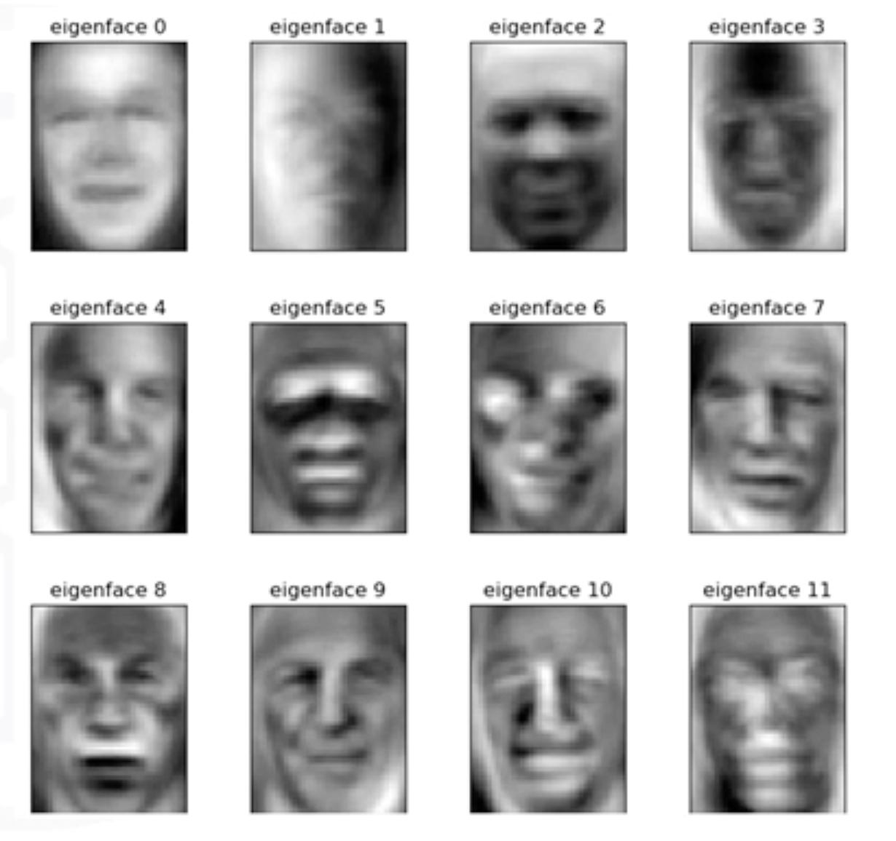
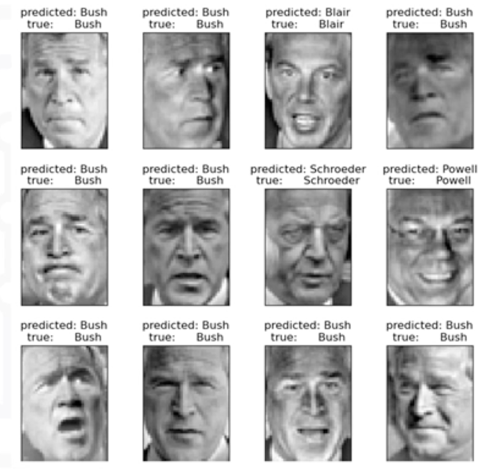
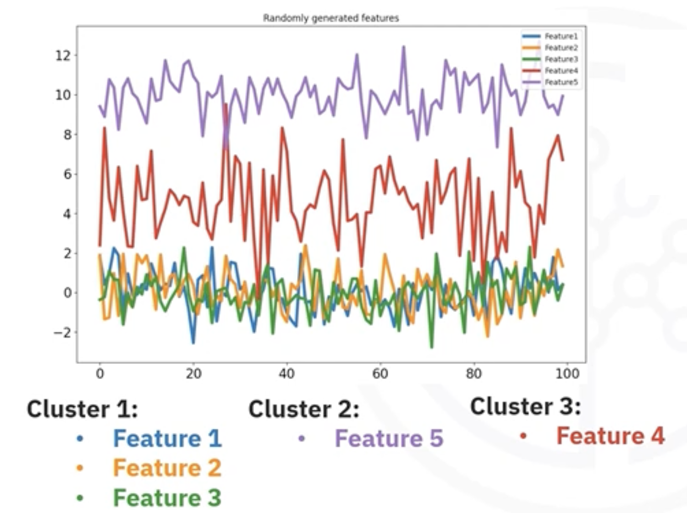

# Clustering, Dimension Reduction, and Feature Engineering

## 1. The Synergy of Techniques
In Machine Learning, individual algorithms are powerful, but their true potential is unlocked when they are combined. **Clustering**, **Dimension Reduction**, and **Feature Engineering** are not just isolated tasks; they are complementary techniques that work together to enhance model performance, computational efficiency, and interpretability. 

- **Clustering** groups similar data points or features.
- **Dimension Reduction** reduces the number of random variables under consideration, simplifying the data structure.
- **Feature Engineering** creates new features or transforms existing ones to better represent the underlying problem.

## 2. Dimension Reduction as a Pre-processing Step

### The Challenge: The Curse of Dimensionality
High dimensional data poses significant challenges for distance-based clustering algorithms like **K-Means** and **DBSCAN**:

- **Volume Expansion:** As dimensionality increases, the volume of the feature space expands rapidly.
- **Sparsity:** Data points become sparse, "drifting" further apart.
- **Loss of Similarity:** In very high dimensions, the concept of "distance" becomes less meaningful because all points tend to be roughly equidistant from each other.

### The Solution: Reduce First, Cluster Later
Techniques like **PCA** (Principal Component Analysis), **t-SNE**, and **UMAP** are often used to reduce dimensions *before* applying clustering algorithms.

- **Efficiency:** Smaller feature sets mean faster computation.
- **Quality:** By removing noise and redundant features, clustering algorithms can often find more robust patterns.
- **Visualization:** While we cannot visualize 100 dimensions, we can project clustering results into 2D or 3D using dimension reduction to visually verify cluster separation.

## 3. Case Study: Eigenfaces for Face Recognition

An excellent example of this synergy is using **Eigenfaces** for face recognition.

1. **Input:** A dataset of 966 unlabeled face images (high dimensional pixel data).
2. **PCA (Dimension Reduction):** The algorithm extracts the top 150 "Eigenfaces". These are the principal components that capture the most variance (key facial features) in the dataset.
3. **Transformation:** All images are projected onto this new, smaller 150-dimensional space.
4. **Modeling:** A Support Vector Machine (SVM) is trained on this reduced data to classify faces.

**Result:** By preserving only the key features, the model achieves high accuracy with a fraction of the computational load.

<table>
<tr>
<td>
 
</td>
<td>
 
</td>
</tr>
</table>

## 4. Clustering for Feature Selection
Clustering isn't just for observations (rows); it can also be applied to **features (columns)**.

### Identifying Redundancy
If you cluster your features based on their statistical properties (e.g., correlation, mean, variance), you can identify groups of features that provide redundant information.

- **Scenario:** You have 5 features.
    - Features 1, 2, and 3 have the same mean (5) and variance (1).
    - Feature 4 has a variance of 2.
    - Feature 5 has a mean of 10.
- **Action:** Running K-Means (with $k=3$) on the *features* themselves will group Features 1, 2, and 3 into a single cluster.
- **Selection:** Since they are redundant, you can select just **one** representative feature from that cluster and discard the others.

This is a form of **Feature Selection** (part of Feature Engineering) that also achieves **Dimension Reduction**.

## 5. Summary

- **Synergy:** These three techniques form a powerful pipeline. Dimension reduction aids clustering, and clustering aids feature selection.
- **Pre-processing:** Reducing dimensions (via PCA, t-SNE) before clustering helps mitigate the "Curse of Dimensionality" and improves distance-based algorithms.
- **Visualization:** Dimension reduction allows us to visualize high-dimensional clusters in 2D or 3D plots.
- **Feature Selection:** Clustering features helps identify and remove redundant variables, simplifying the model without losing critical information.

---

**Next:** [Dimension Reduction Algorithms Theory](./09_dimension_reduction_algorithms_theory.md)