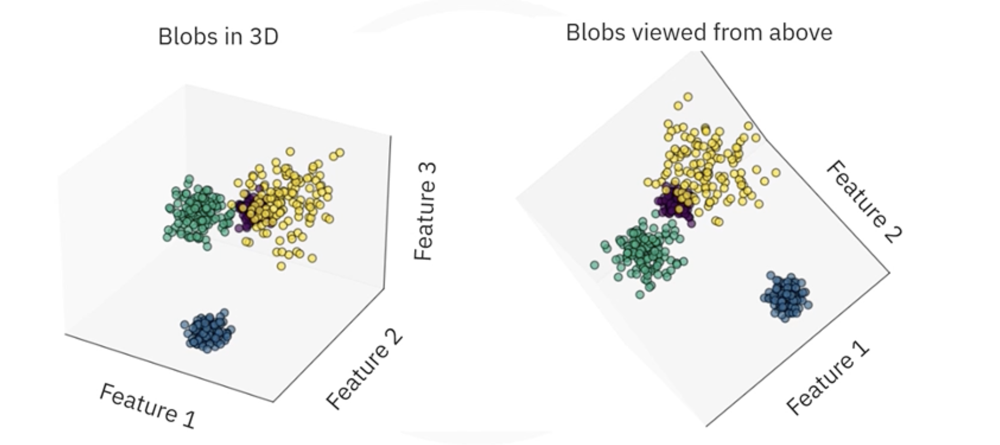
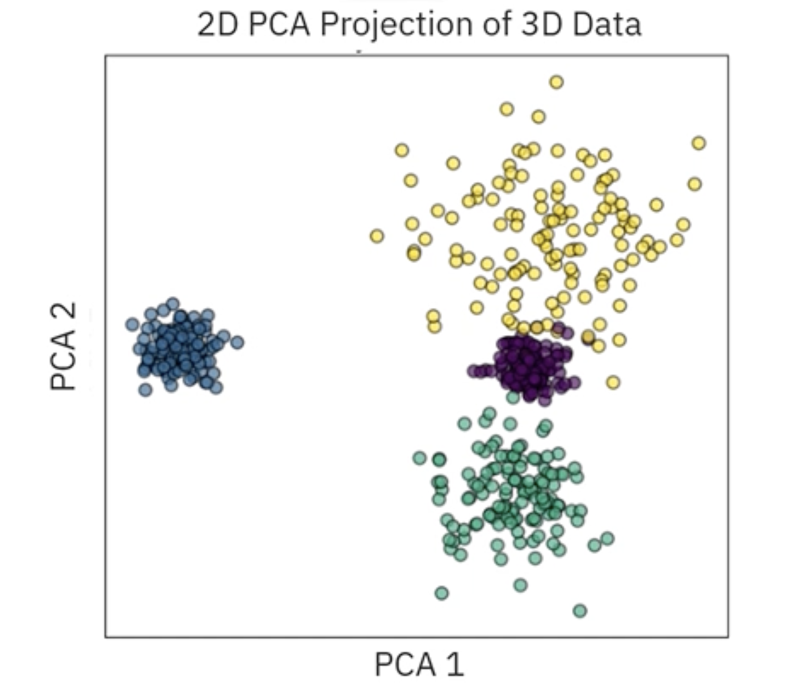
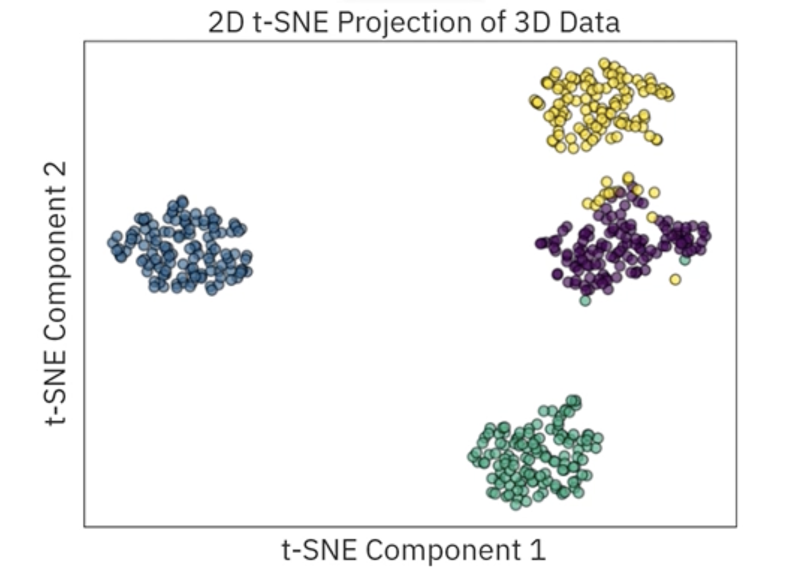
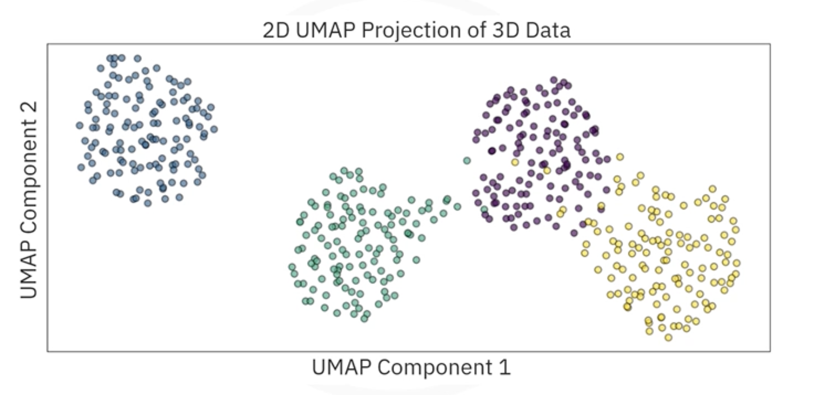

# Dimension Reduction Algorithms

## 1. Principal Component Analysis (PCA)

**PCA** is the most common *linear* dimensionality reduction technique. It assumes that the features in the dataset are linearly correlated.

*   **Strengths:** Fast, deterministic, and preserves global structure.
*   **Weaknesses:** Only captures linear relationships.

### The Mathematics of PCA
PCA works by identifying the "principal components", new axes that maximize the variance (information) in the data. These components are orthogonal (uncorrelated) to each other.

1. **First Component:** Captures the direction of maximum variance.
2. **Second Component:** Captures the remaining variance orthogonal to the first, and so on.

> ⚠️ **Note on Mathematics:** The mathematical foundation of PCA has been already explained in great detail in the [Principal Component Analysis](../../../01_math/02_linear_algebra_for_ml_and_ds/07_principal_component_analysis/) section of our Linear Algebra notes.

## 2. t-Distributed Stochastic Neighbor Embedding (t-SNE)

**t-SNE** is a *non-linear* probabilistic tehnique. Unlike PCA, which focuses on preserving large global distances (variances), t-SNE focuses on preserving **local structure**, keeping similar points close together.

*   **Strengths:** Excellent for visualizing clusters in complex data (images, text).
*   **Weaknesses:** Computationally expensive ($O(N^2)$), stochastic (results change every run), and **sensitive to hyperparameters** (perplexity). It often struggles to preserve global structure (distances between clusters may be meaningless).

### The Mathematics of t-SNE
t-SNE converts Euclidean distances between points into conditional probabilities that represent similarities.

#### Step 1: High-Dimensional Similarity ($P_{ij}$)
In the high-dimensional space, we compute the similarity between point $x_i$ and $x_j$ using a Gaussian distribution. The probability that $x_i$ would pick $x_j$ as its neighbor is:

$$
p_{j|i} = \frac{\exp(-||x_i - x_j||^2 / 2\sigma_i^2)}{\sum_{k \neq i} \exp(-||x_i - x_k||^2 / 2\sigma_i^2)}
$$

- If points are close, $p_{j|i}$ is high.
- If points are far, $p_{j|i}$ is almost zero.
- $\sigma_i$ is determined by a "perplexity" hyperparameter (loosely, the number of effective neighbors).

#### Step 2: Low-Dimensional Similarity ($Q_{ij}$)
In the low-dimensional map (e.g., 2D), we define a similar probability $q_{ij}$, but using a **Student's t-distribution** (with 1 degree of freedom) instead of a Gaussian.

$$
q_{ij} = \frac{(1 + ||y_i - y_j||^2)^{-1}}{\sum_{k \neq l} (1 + ||y_k - y_l||^2)^{-1}}
$$

**Why t-distribution?**  
The "Heavy Tail" of the [t-distribution](../../../01_math/04_probability_and_statistics_for_ml_and_ds/08_hypothesis_testing/08_t-distribution.md) solves the **Crowding Problem**. In high dimensions, there is more space. When we squash data into 2D, points get crowded. The heavy tail allows moderately distant points to be placed further apart in the low-dimensional map without crushing the local clusters.

#### Step 3: Optimization (KL Divergence)
We want the low-dimensional probabilities ($Q$) to match the high-dimensional probabilities ($P$). We minimize the **Kullback-Leibler (KL) Divergence** using Gradient Descent:

$$
C = KL(P||Q) = \sum_i \sum_j p_{ij} \log \frac{p_{ij}}{q_{ij}}
$$

## 3. Uniform Manifold Approximation and Projection (UMAP)
**UMAP** is a modern *non-linear* technique that is often seen as a superior alternative to t-SNE. It is based on **Manifold Theory**, assuming the data lies on a low-dimensional manifold embedded in high-dimensional space.

### The Mathematics of UMAP
UMAP constructs a high-dimensional graph representation of the data and optimizes a low-dimensional graph to be structurally similar.

#### Step 1: Constructing the High-Dimensional Graph
Similar to t-SNE, UMAP computes nearest neighbors. However, it uses a varying metric based on local connectivity. It defines a "fuzzy simplicaial set" where the weight of the edge between $x_i$ and $x_j$ is roughly:

$$
w_{ij} = \exp\left(\frac{-(d(x_i, x_j) - \rho_i)}{\sigma_i}\right)
$$

- $\rho_i$: The distance to the nearest neighbor (ensures local connectivity).
- This adapts to varying densities in the data better than t-SNE.

#### Step 2: Optimization
UMAP uses **Cross-Entropy** as its cost function instead of KL Divergence.

$$
C = \sum_{i \neq j} \left( p_{ij} \log \left( \frac{p_{ij}}{q_{ij}} \right) + (1 - p_{ij}) \log \left( \frac{1 - p_{ij}}{1 - q_{ij}} \right) \right)
$$

**Key Difference:**  
The second term $(1 - p_{ij})$ forces UMAP to pay attention to points that are *far apart* (pushing them away in 2D if they are far in ND). This allows UMAP to preserve **global structure** much better than t-SNE.

## 4. Comparison on Simulated Data
Imagine 4 blobs of data in 3d space: 2 distinct, and 2 slighly overlapping.

 

1.  **PCA:** Separates the blobs well because they are Gaussian (linearly correlated). It acts as a rotation:

2.  **t-SNE:** Creates very distinct, separated clusters. However, it might struggle with the overlapping region, occasionally mislabeling points or creating fake separation where none exists:

3.  **UMAP:** Separates the clusters but tends to preserve the relative positions better. If two clusters overlap in 3D, UMAP is more likely to show that overlap in 2D compared to t-SNE, providing a truer representation of the topology.

## 5. Summary

| Feature | PCA | t-SNE | UMAP |
| :--- | :--- | :--- | :--- |
| **Type** | Linear | Non-Linear | Non-Linear |
| **Focus** | Variance (Global) | Local Similarity | Local & Global Structure |
| **Speed** | Very Fast | Slow - O(N²) | Fast |
| **Use Case** | Pre-processing, Noise Reduction | Visualization | Visualization, General Dim. Reduction |

---

**Next:** 