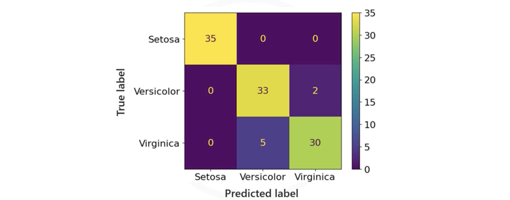

# Classification Metrics and Evaluation Techniques

## 1. Supervised Learning Evaluation

**Supervised learning evaluation** establishes how well a machine learning model can predict the outcome for unseen data. It is a critical step for understanding model effectiveness and involves comparing model predictions against ground truth labels.

### The Train-Test-Split Technique
When training a model, we never want to test it on the same data it learned from (this would be like giving a student the exam answers before the test).

The **Train-Test-Split** technique divides the dataset into two distinct subsets: 
1. **Training Set (70-80%):** Used to train the model to find patterns.
2. **Test Set (20-30%):** A "hold-out" set used strictly to evalaute how well the model generalizes to new, unseen data.

## 2. The Confusion Matrix
The **Confusion Matrix** is the foundation for most classification metrics. It is a table that breaks down the number of correct and incorrect predictions by class.

For a binary classification problem (e.g., Predicting "Pass" or "Fail"), the matrix looks like this:

| | **Predicted: Pass** (Positive) | **Predicted: Fail** (Negative) |
| :--- | :--- | :--- |
| **Actual: Pass** (Positive) | **True Positive (TP)** *(Correctly predicted Pass)* | **False Negative (FN)** *(Predicted Fail, but was Pass)* |
| **Actual: Fail** (Negative) | **False Positive (FP)** *(Predicted Pass, but was Fail)* | **True Negative (TN)** *(Correctly predicted Fail)* |

💡 A good way to remember this is with the sentence: "We {Truely | Falsely} predicted as {Positive (True) | Negative (False) }. The two words we use will come together and tell us the classification:

* "We **TRUE**ly classified as **POSITIVE**" = True Positive (TP).
* "We **TRUEl**y classified as **NEGATIVE**" = True Negative (TN).
* "We **FALSE**ly classified as **POSITIVE**" = False Positive (FP).
* "We **FALSE**ly classified as **NEGATIVE**" = False Negative (FN).  

*In the heatmap above (Iris dataset), the diagonal represents correct predictions (hot/yellow areas), while off-diagonal cells represent errors.*

## 3. Key Evaluation Metrics

### 3.1. Accuracy
**Accuracy** is the most intuitive metric: the ratio of correctly predicted observations to the total observations.

$$
\text{Accuracy} = \frac{\text{TP} + \text{TN}}{\text{Total Observations}}
$$

*   **Example:** If you predicted 7 students would pass and 3 would fail, and you got 7 predictions right in total out of 10, your accuracy is 70%.
*   **Limitation:** Accuracy can be misleading if classes are imbalanced (e.g., if 99% of emails are NOT spam, a model that predicts "Not Spam" for everything has 99% accuracy but is useless).

### 3.2. Precision
**Precision** answers the question: *"Of all the instances the model predicted as Positive, how many were actually Positive?"*

$$
\text{Precision} = \frac{\text{TP}}{\text{TP} + \text{FP}}
$$

*   **When to use it:** When the cost of a **False Positive** is high.
*   **Example:** A **Movie Recommendation System**. If you recommend a movie (Predicted Positive) and the user hates it (False Positive), you lose trust/money. You want to be precise about what you recommend.

### 3.3. Recall (Sensitivity)
**Recall** answers the question: *"Of all the actual Positive instances in the dataset, how many did the model correctly find?"*

$$
\text{Recall} = \frac{\text{TP}}{\text{TP} + \text{FN}}
$$

*   **When to use it:** When the cost of a **False Negative** is high (the cost of missing a positive case).
*   **Example:** **Medical Diagnosis**. If a patient has a disease (Actual Positive), it is critical to find it. Predicting they are healthy (False Negative) could be fatal. You want high recall to catch all cases.

### 3.4. F1 Score
In many real-world scenarios, Precision and Recall are a trade-off (increasing one often decreases the other). The **F1 Score** combines them into a single metric using the **harmonic mean**.

$$
\text{F1 Score} = 2 \cdot \frac{\text{Precision} \cdot \text{Recall}}{\text{Precision} + \text{Recall}}
$$

*   **When to use it:** When you need a balance between Precision and Recall, or when your classes are unevenly distributed. It penalizes extreme values (e.g., if Precision is 100% but Recall is 1%, the F1 score will be very low).

## 4. Summary Table

| Metric | Formula | Best Used When... |
| :--- | :--- | :--- |
| **Accuracy** | $\frac{TP+TN}{Total}$ | Classes are balanced; errors are equally bad. |
| **Precision** | $\frac{TP}{TP+FP}$ | False Positives are expensive (Spam filter, Recommendations). |
| **Recall** | $\frac{TP}{TP+FN}$ | False Negatives are expensive (Disease diagnosis, Fraud detection). |
| **F1 Score** | $2 \cdot \frac{P \cdot R}{P+R}$ | You need a balance; uneven class distribution. |

---

**Next:** [Evaluating Classification Models Lab](./02_evaluating_classification_models_lab.ipynb)