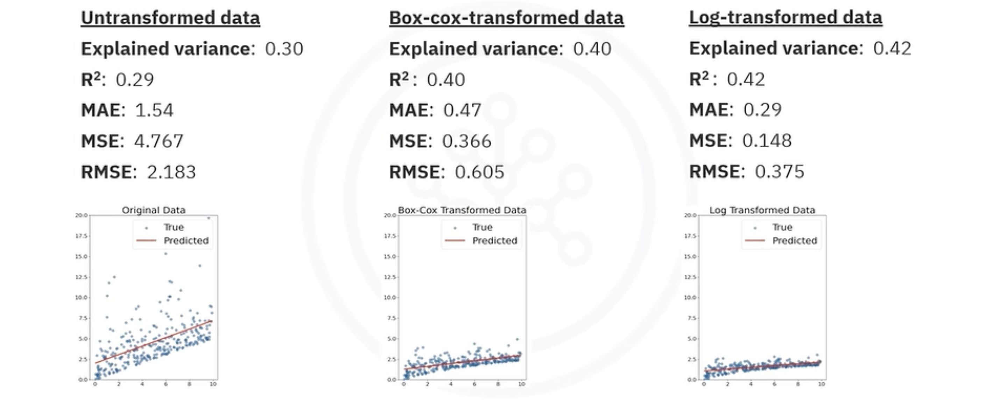

# Regression Metrics and Evaluation Techniques

## 1. Why Evaluate Regression Models?

Evaluating a regression model involves determining how accurately the model can predict **continuous numerical values**, such as exam grades, house prices, or temperature.

Models are rarely perfect. The difference between the actual value ($y$) and the value predicted by your model ($\hat{y}$) is called the **Error** or **Residual**.

* **Positive Error:** The actual value is higher than the prediction.
* **Negative Error:** The actual value is lower than the prediction.

Evaluating a regression model is essentially measuring the magnitude and distribution of these errors to understand how "good" the fit is.

## 2. Key Regression Metrics

There are four primary metrics used to quantify the performance of regression models.

### 2.1. Mean Absolute Error (MAE)
**MAE** is the average of the absolute differences between the predicted values and the actual values.

$$
\text{MAE} = \frac{1}{n} \sum_{i=1}^{n} |y_i - \hat{y}_i|
$$

* **Interpretation:** It tells you, on average, how far off your predictions are. If predicting exam grades (0-100) and MAE is 5, your predictions are typically off by 5 points.
* **Pros:** Easy to interpret. It treats all errors equally (linear penalty).
* **Cons:** It doesn't penalize large errors heavily.

### 2.2. Mean Squared Error (MSE)
**MSE** takes the difference, squares it, and then averages the results.

$$
\text{MSE} = \frac{1}{n} \sum_{i=1}^{n} (y_i - \hat{y}_i)^2
$$

* **Interpretation:** Because it squares the errors, larger errors contribute significantly more to the total.
* **Pros:** Heavily penalizes the outliers and large errors. Useful if being "very wrong" is much worse than being "a little wrong". 
* **Cons:** Hard to interpret because the units are squared (e.g., "points squared", or "dollars squared").

### 2.3. Root Mean Squared Error (RMSE)
**RMSE** is simply the square root of the MSE.

$$
\text{RMSE} = \sqrt{\text{MSE}} = \sqrt{\frac{1}{n} \sum_{i=1}^{n} (y_i - \hat{y}_i)^2}
$$

* **Interpretation:** It brings the units back to the original scale (e.g., "points" or "dollars"), making it interpretable like MAE.
* **Comparison:** RMSE will always be greater than or equal to MAE. If RMSE is *much* larger than MAE, it indicates that your model is making some very large errors (outliers).

### 2.4. R-Squared ($R^2$)
Also known as the **Coefficient of Determination**, $R^2$ measures the proportion of the variance in the dependent variable that is predictable from the independent variable(s).

$$
R^2 = 1 - \frac{\text{Unexplained Variance}}{\text{Total Variance}}
$$

*   **Range:** Typically 0 to 1.
    *   **1:** Perfect model (Predictions match actuals exactly).
    *   **0:** The model is no better than simply predicting the mean of the target for every point.
    *   **Negative:** The model is arbitrarily worse than predicting the mean (e.g., fitting a line that goes the complete opposite direction).
*   **Pros:** Great for communicating performance to non-technical stakeholders (e.g., "Our model explains 85% of the variation in sales").
*   **Cons:** Can be misleading for non-linear models or if the variance of the dataset is very low to begin with.

## 3. Visual Evaluation

Metrics alone are not enough. It is crucial to **visualize** your results.

### Actual vs. Predicted Plot
Plot the actual values on the X-axis and predicted values on the Y-axis.
*   **Ideal:** All points fall on the 45-degree diagonal line ($y=x$).
*   **Reality:** Points scatter around the line. The tighter the cluster, the better the model.

### Impact of Transformations
Sometimes, transforming the target variable (e.g., Log transformation or Box-Cox) can significantly improve performance.

*   **Example:** Predicting a target with an exponential distribution. A linear model might perform poorly.
*   **Transformation:** Applying a Log transformation makes the relationship more linear.
*   **Result:** Visual plots show data concentrating closer to the best-fit line, and metrics like $R^2$ increase while RMSE decreases.

## 4. Summary Table

| Metric | Formula Idea | Interpretation |
| :--- | :--- | :--- |
| **MAE** | Average Absolute Error | "My predictions are off by about X units on average." |
| **MSE** | Average Squared Error | "I want to punish large errors heavily." (Hard to interpret units). |
| **RMSE** | Square Root of MSE | "I want to punish large errors heavily, but keep the units readable." |
| **$R^2$** | Variance Ratio | "My model explains X% of the patterns in the data." |

---

**Next:** [Evaluating Random Forest Performance Lab](./04_evaluating_random_forest_performance.ipynb)