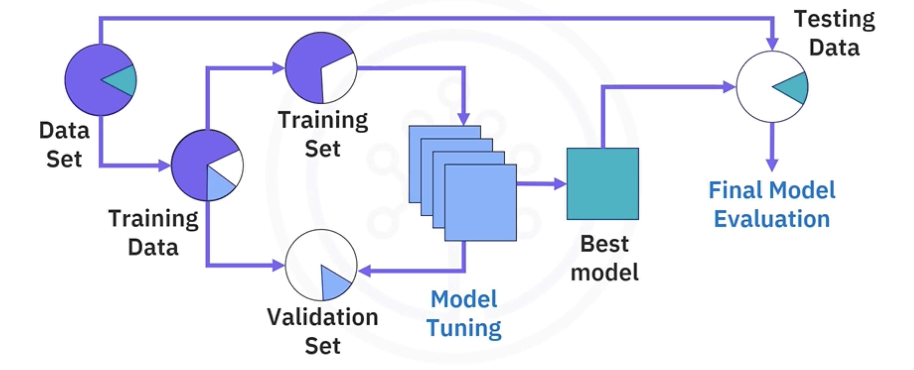
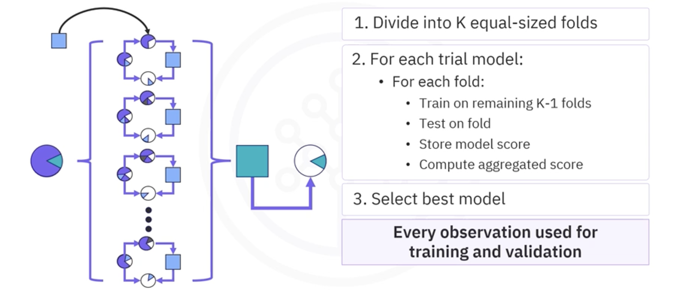
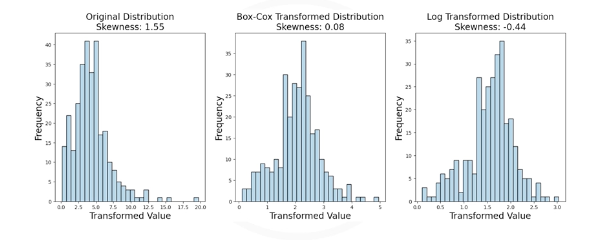

# Cross-Validation and Advanced Model Validation Techniques

## 1. What is Model Validation?
**Model Validation** is the process of optimizing your machine learning model without jeopardizing its ability to predict well on unseen data. Its primary goal is to **to prevent** overfitting while tuning hyperparameters.

### The Problem: Data Snooping
In a simple train-test split, we use the training set to learn and the test set to evaluate. But most models have **hyperparameters** (settings like `k` in KNN, or `alpha` in Ridge Regression) that we need to tune.

If we try different hyperparameters and check the results on the **test set** each time to pick the best one, we are **cheating**. We are effectively using the test set to train the model (by selecting the best settings for *that specific* test data). This is called **data snooping** (or data leakage). The result is a model that is overfit to the test set and will likely fail on real-world data.

### The Solution: The Validation Set
To fix this, we need to decouple model tuning from the final evaluation. We split the data into **three** parts:

1. **Training Set:** Used to train the model parameters (weights/coefficients).
2. **Validation Set:** Used to tune **hyperparameter**. We train on trainin data, test on validation data, pick the best settings, and repeat.
3. **Test Set:** Held back completely unseen. Used **ONLY ONCE** at the very end to estimate the final performance.

## 2. K-Fold Cross Validation
Using a single fixed validation set has risks:

- **Sample Bias:** The validation set might just happen to be "easy" or "hard" by chance.
- **Data Waste:** If you have a small dataset, setting aside 20% for validation and 20% for testing leaves very little for training.

**K-Fold Cross-Validation** is a more robust technique that solves these issues.

### How It Works
1. Divide the training data into **K** equal-sized folds (e.g., K=5).
2. **Iterate K times:**
    - In iteration 1: Use **Fold 1** as the validation set, and the other K-1 folds as the training set.
    - In iteration 2: Use **Fold 2** as the validation set, and the others fro training
    - ... and so on for all K folds.
3. **Aggregate:** Calculate the average score (e.g., accuracy) across all K trials.

This ensures that **every data point** is used for both training and validation exactly once.

### Benefits
- **More Data:** You use all your training data for learning.
- **Robustness:** The performance estimate is more stable because it's an average of K different experiments, smoothing out the noise.

## 3. Advanced Strategies

### 3.1. Stratified Cross-Validation (Classification)
In classification problems, classes are often **imbalanced** (e.g., 90% Class A, 10% Class B). A random split might accidentally put all Class B instances in the validation fold, making it impossible for the model to learn them during training. **Stratified K-Fold** ensures that the **class distribution is preserved** in every fold (e.g., every fold will have exactly 90% Class A and 10% Class B). This prevents bias.

### 3.2. Handling Skewed Targets (Regression)
In regression problems, if your target variable is highly skewed (non-normal), many models (like Linear Regression) will struggle. In this case:

1. **Tranformation:** Apply a **log transform** or **box-cox transform** to the target variable to make it more normal (bell-shaped).
2. **Validation:** Fit your model to the transformed target, and then inverse-transform the predictions back to the original scale for the final evaluation.

## 4. Summary

*   **Data Snooping:** Never use your Test Set to make decisions about model settings (hyperparameters).
*   **Validation Set:** Create an intermediate set for tuning.
*   **K-Fold Cross-Validation:** A powerful technique to perform validation without wasting data. It provides a more reliable estimate of model performance.
*   **Stratified K-Fold:** Essential for imbalanced classification tasks to maintain class ratios.

---

**Next:** [Regularization in Regression and Classification Theory](./08_regularization_in_regression_and_classification_theory.md)