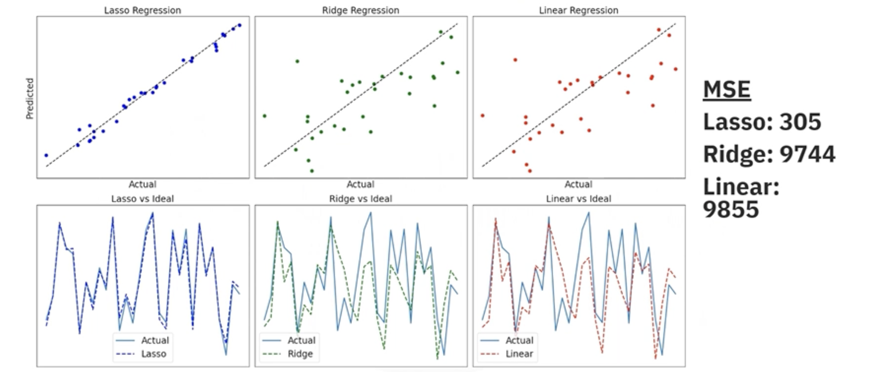

# Regularization in Regression and Classification

## 1. The Problem: Overfitting and Noise Sensitivity

Standard Linear Regression aims to find the line (or hyperplane) that minimizes the error between predictions and actual values (usually Mean Squared Error, MSE).

However, in the presence of **nosei** (outliers) or when the number of features is large, standard Linear Regression can be too flexible. It tries to fit *every* data point, including the noise. This leads to:

1. **Overfitting:** The model works great on training data but fails on new data.
2. **Large Coefficients:** The model assigns massive positive or negative weights to features to twist the line to hit noisy points.

**Regularization** is a technique to prevent this. It constrains the model by discouraging it from assigning large weights to features.

## 2. The Solution: The Penalty Term

Regularization adds a **penalty term** to the standard cost function.

$$
\text{Regularized Cost} = \text{Mean Squared Error (MSE)} + \lambda \cdot (\text{Penalty})
$$

**$\lambda$ (Lambda or Alpha)** is a hyperparameter that controls the strength of the penalty.
   * If $\lambda = 0$, we get standard Linear Regression.
   * If $\lambda$ is very high, the penalty dominates, forcing all coefficients to be near zero (underfitting).

## 3. Types of Regularized Regression

The two most common methods differ only in *how* they calculate the penalty.

### 3.1. Ridge Regression (L2 Regularization)
Ridge adds a penalty equal to the **square of the magnitude** of the coefficients. 

$$
\text{Cost}_{\text{Ridge}} = \text{MSE} + \lambda \sum_{j=1}^{p} \theta_j^2
$$

* **Effect:** It shrinks all coefficients towards zero but rarely makes them exactly zero.
* **Best Use:** When most features are useful and you want to reduce the impact of noise (multicollinearity). It distributes the weight among correlated features.

### 3.2. Lasso Regression (L1 Regularization)
Lasso (Least Abdolute Shrinkage and Selection Operator) adds a penalty equal to the **absolute value of the magnitude** of the coefficients.

$$
\text{Cost}_{\text{Lasso}} = \text{MSE} + \lambda \sum_{j=1}^{p} |\theta_j|
$$

* **Effect:** It shrinks coefficients, and crucially, it can shrink some coefficients **exactly to zero**.
* **Best Use:** Feature selection. If you have a dataset with 100 features but only 5 are important (sparse data), Lasso will automatically set the other 95 weights to zero, effectively removing them from the model.

## 4. Performance Comparison (Signal-to-Noise Ratio)

How do these models compare in different environments?

### 4.1. High SNR (Clean Data)
When the data is clean (High Signal-to-Noise Ratio):

* **Linear Regression:** Performs well.
* **Ridge:** Performs well.
* **Lasso:** Performs best at identifying zero coefficients (finding the "true" sparse features).

### 4.2. Low SNR (Noisy Data)
When the data is noisy (Low Signal-to-Noise Ratio):

* **Linear Regression:** Fails! It overfits the noise, assigning massive positive/negative coefficients where they should be zero.
* **Ridge:** Performs decently by shrinking the noise-driven coefficients.
* **Lasso:** **Winner!** It is robust to noise and effectively filters out irrelevant features by zeroing their weights.

## 5. Summary Table

| Feature | Linear Regression | Ridge Regression (L2) | Lasso Regression (L1) |
| :--- | :--- | :--- | :--- |
| **Penalty** | None | Sum of Squared Weights| Sum of Absolute Weights |
| **Effect on Weights** | Can be very large | Shrinks towards zero | Shrinks to exactly zero |
| **Feature Selection** | No | No | **Yes** (Automated) |
| **Noise Sensitivity** | High (Unstable) | Low (Stable) | Low (Stable) |
| **Best For** | Simple, clean data | Multicollinearity, Dense data | Sparse data, Feature Selection |

---

**Next:** [Regularization in Linear Regression Lab](./09_regularization_in_regression_and_classification_lab.ipynb)