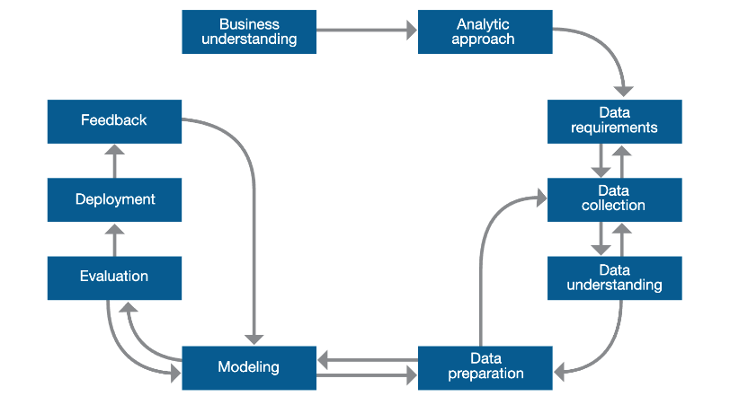

# Methodology: From Business Problem to Deployed Solution

A successful data science project is more than just code — it's a disciplined process that connects a business question to a measurable outcome. This pillar is the operating system for every project built on top of this repository.

The framework adopted here is the [Foundational Methodology for Data Science](./references/IBMOpenSource_FoundationalMethologyforDataScience.PDF) by **John B. Rollins**. It is a 10-stage lifecycle that covers a project from inception to feedback, emphasizing clear communication, iterative development, and alignment with business goals.

Each stage is documented in its own file within this folder. These files serve as both an **explanation of the process** and as **practical, reusable guides** that can be followed step-by-step for any new freelance project — whether it's a classification problem, a regression task, a clustering analysis, or a one-time exploratory report.

## How to Use This Pillar

1. **For a new project:** Copy the 10 stage files into your project repository. Follow them sequentially, filling in the templates as you go. Each stage has a checklist at the bottom — don't move to the next stage until the checklist is complete.

2. **For reference:** Each stage opens with John B. Rollins' own description of that stage, followed by concrete steps, decision frameworks, and documentation templates. When in doubt during a project, come back to the relevant stage.

3. **For learning:** The stage files cross-link to the [Math Foundations](../01_math/), [Toolkit](../02_toolkit/), [Specializations](../03_specializations/), and [MLOps](../04_mlops/) pillars wherever a concept is covered in depth.

## The 10 Stages

### Stages 1–2: Define the Problem

| Stage | Purpose | Key Output |
| :--- | :--- | :--- |
| **[1. Business Understanding](./01_business_understanding.md)** | Define the problem, objectives, and success criteria in business terms. | Business problem statement, success criteria, solution requirements, stakeholder sign-off |
| **[2. Analytic Approach](./02_analytic_approach.md)** | Translate the business problem into an analytical framework — problem type, candidate algorithms, evaluation metrics, validation strategy. | ML problem framing, candidate models, primary metric, acceptance threshold |

### Stages 3–6: Get and Prepare the Data

| Stage | Purpose | Key Output |
| :--- | :--- | :--- |
| **[3. Data Requirements](./03_data_requirements.md)** | Specify exactly what data is needed — target variable, fields, sources, formats, privacy constraints. | Data shopping list, target variable definition, privacy review |
| **[4. Data Collection](./04_data_collection.md)** | Acquire the data using an ELT process: Extract → Load (raw) → Transform → Load (interim). | `/data/raw/` (untouched), `/data/interim/` (standardized), gap assessment |
| **[5. Data Understanding](./05_data_understanding.md)** | Explore the data through EDA — descriptive statistics, distributions, correlations, missing values, outliers. | EDA summary with data quality issues and planned actions for Stage 6 |
| **[6. Data Preparation](./06_data_preparation.md)** | Clean, engineer, encode, split, and scale the data into a model-ready format. | `/data/processed/` (X_train, X_test, y_train, y_test), full transformation log |

### Stages 7–8: Build and Evaluate the Model

| Stage | Purpose | Key Output |
| :--- | :--- | :--- |
| **[7. Modeling](./07_modeling.md)** | Train baseline and candidate models, tune hyperparameters, select the champion model. | Champion model (saved), runner-up, experiment log |
| **[8. Evaluation](./08_evaluation.md)** | Final, unbiased evaluation on the holdout test set. Translate metrics into business impact. Go/no-go decision. | Test set performance, diagnostic visualizations, business impact statement, deployment decision |

### Stages 9–10: Deploy and Monitor

| Stage | Purpose | Key Output |
| :--- | :--- | :--- |
| **[9. Deployment](./09_deployment.md)** | Deliver the model — as a report, batch pipeline, API, dashboard, or code handoff — based on Stage 1 requirements. | Live deliverable, handoff documentation |
| **[10. Feedback](./10_feedback.md)** | Monitor live performance, measure business impact, decide: continue, retrain, rebuild, or decommission. | Performance logs, business impact assessment, next-cycle decision |

## Adapting the Methodology

The 10-stage lifecycle is comprehensive, but not every project goes equally deep in every stage. The framework adapts to the project's goal:

### The Data Analysis Roadmap

> *"What happened and why?"*

- **Focus:** Stages 1–6 carry most of the weight.
- **Stage 7 (Modeling):** May not involve ML at all — the "model" is the final analysis, polished visualizations, and statistical tests to validate insights.
- **Stage 9 (Deployment):** The deliverable is a report, presentation, or dashboard — not an API.
- **Stage 10 (Feedback):** A follow-up meeting to review whether the analysis informed the intended decisions.

### The Data Science Roadmap

> *"What will happen and why?"*

- **Focus:** All 10 stages, with emphasis on interpretability.
- **Stage 7 (Modeling):** Builds a predictive model, often an interpretable one (Logistic Regression, Decision Tree), to understand the key drivers behind an outcome.
- **Stage 9 (Deployment):** A detailed findings report, a prototype Streamlit dashboard, or both.
- **Stage 10 (Feedback):** Periodic check-in to validate that the model's predictions align with reality.

### The Machine Learning Engineering Roadmap

> *"Build a robust, scalable prediction system."*

- **Focus:** All 10 stages with heavy technical depth in Stages 7–10.
- **Stage 7 (Modeling):** Maximizes predictive performance — complex models, extensive tuning, Pipeline architecture.
- **Stage 9 (Deployment):** Full [MLOps](../04_mlops/) stack — [API](../04_mlops/02_api_development/), [containerization](../04_mlops/03_containerization/), [cloud deployment](../04_mlops/04_cloud_deployment/), [dashboards](../04_mlops/05_interactive_dashboards/).
- **Stage 10 (Feedback):** Automated monitoring, drift detection, scheduled retraining — covered in [Monitoring and Maintenance](../04_mlops/06_monitoring_and_maintenance/).
